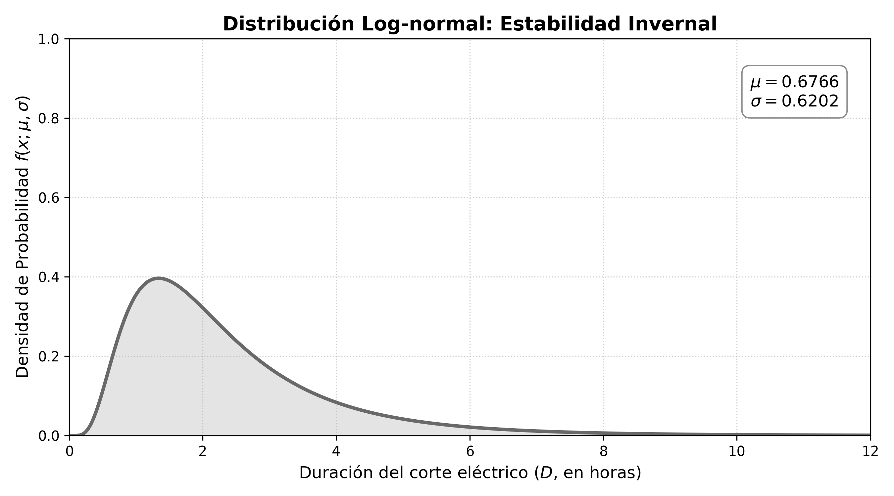

# Estudio de Caso: Calibración Termodinámica, Eléctrica y Cinética de Degradación

## Motivación y Contexto del Estudio {#sec-motivacion-contexto}

El presente capítulo consolida el marco teórico desarrollado previamente, trasladándolo de una formulación matemática abstracta a un escenario de aplicación altamente crítico: la red de frío para la preservación de vacunas en Tuxtla Gutiérrez, Chiapas. La elección de esta región geográfica como caso de estudio se debe a la combinación de condiciones climatológicas de calor extremo y a la vulnerabilidad de la infraestructura eléctrica local ante fenómenos meteorológicos. Bajo este entorno, los refrigeradores institucionales que resguardan los biológicos de alto valor inmunológico operan bajo condiciones de estrés continuo.

Para garantizar la validez y la utilidad del modelo computacional, se evitara la parametrización arbitraria de la Ecuación Diferencial Estocástica (EDE). Un modelo probabilístico con tasas de intensidad o volatilidades carentes de fundamento físico produciría trayectorias desconectadas de la realidad operativa. Por consiguiente, el objetivo central de este capítulo es la calibración rigurosa de las variables del sistema. 

El proceso de estimación y asignación de parámetros se desarrollará en las siguientes tres fases analíticas:

1. **Caracterización Estocástica del Suministro Eléctrico:** Mediante el análisis de datos oficiales de la Comisión Federal de Electricidad (CFE), se modelará la frecuencia y la duración de las interrupciones del servicio eléctrico. Estas estimaciones permitirán estructurar la conmutación de la cadena de Markov y los Procesos de Poisson No Homogéneos acoplados a la ecuación.
2. **Calibración Termodinámica del Equipo Operativo:** A partir de las especificaciones técnicas y requerimientos normados por la Organización Mundial de la Salud (OMS), se deducirán analíticamente los coeficientes de reversión a la media ($\kappa$) y las volatilidades térmicas ($\sigma$) que dictan el enfriamiento activo y la inercia pasiva del refrigerador de estudio.
3. **Cinética de Degradación Biológica:** Finalmente, se vinculara el comportamiento térmico dada por la EDE con la Ecuación de Arrhenius, estableciendo el marco cuantitativo necesario para evaluar la pérdida de viabilidad farmacológica que sufren las vacunas durante algun fallo.

## Datos Base e Histórico de Interrupciones Eléctricas {#sec-datos-cfe}

El objetivo de esta fase es modelar la tasa de ocurrencia y la escala temporal de las interrupciones del suministro eléctrico en el área geográfica de Tuxtla Gutiérrez, Chiapas. Para evitar supuestos teóricos alejados de la realidad operativa de la red local, los datos de partida no se asignaron de manera arbitraria, sino que se obtuvieron a través de los registros oficiales de la Comisión Federal de Electricidad (CFE). Mediante una solicitud de información pública de transparencia dirigida a la CFE, se obtuvo el registro histórico del promedio mensual de interrupciones y su duración para el municipio de Tuxtla Gutiérrez.

A partir de dicha solicitud, se recabó el comportamiento histórico del municipio para el periodo comprendido entre los años 2019 y 2025. La @tbl-interrupciones-cfe contiene dicha información, presentando el número de interrupciones promedio por mes y la duración promedio en horas por cada corte de energía.

| Año | Número de interrupciones promedio por mes | Duración Promedio de las interrupciones (Horas) |
|:---:|:---:|:---:|
| 2019 | 25 | 2.02 |
| 2020 | 42 | 1.73 |
| 2021 | 47 | 2.03 |
| 2022 | 40 | 2.59 |
| 2023 | 49 | 2.23 |
| 2024 | 43 | 2.39 |
| 2025 | 38 | 2.02 |

: Interrupciones eléctricas en Tuxtla Gutiérrez, Chiapas (Fuente: Solicitud de Transparencia a la CFE). {#tbl-interrupciones-cfe}

El análisis de la @tbl-interrupciones-cfe muestra un incremento significativo en la frecuencia de fallas a partir del año 2020, estabilizándose en una franja superior a los 40 cortes mensuales. Este cambio se debe al crecimiento de la carga térmica residencial e industrial y a la saturación de los transformadores de distribución en la mancha urbana.

Para la calibración de la EDE en este trabajo de investigación, se selecciono el año **2024** como el escenario de línea base. Dicho año presenta una media mensual de **43 interrupciones por mes** con una duración promedio por corte de **2.39 horas**. Al proyectar esta tasa mensual a una tasa anual, se tiene que el número total de interrupciones al año esperadas a nivel municipal ($N_{total}$) es:

$$
N_{total} = 43 \text{ cortes/mes} \times 12 \text{ meses} = 516 \text{ cortes/año}
$$ {#eq-cortes-totales}

## Corrección de Escala Espacial (Factor $\kappa_{espacial}$) {#sec-escala-espacial}

### Justificación de la Reducción de Escala
El valor de $516$ cortes al año obtenido en la @eq-cortes-totales es un dato agregado de todo el municipio, asi que utilizar directamente este valor para un solo refrigerador implicaría asumir que el centro de almacenamiento de vacunas sufre más de un apagón diario, lo cual no es físicamente real. Este error ocurre al ignorar que un edificio está conectado a un solo nodo de la red, no a todos simultáneamente.

Para solucionar esto, introducimos un factor de escala espacial. De acuerdo con el Programa para el Desarrollo del Sistema Eléctrico Nacional (PRODESEN) y los diagramas de infraestructura del Centro Nacional de Control de Energía (CENACE) [@sener2024prodesen], la mancha urbana de Tuxtla Gutiérrez está alimentada de manera sectorizada por exactamente **8 subestaciones principales** de distribución (Tuxtla Céntrica, Oriente, Poniente, Terán, Tuxtla Norte, Tuxtla Dos, Mactumatzá y Real del Bosque).

### La Esperanza Matemática Local
Asumiendo que los cortes de energía se distribuyen de manera uniforme sobre estas subestaciones, la probabilidad $p$ de que un corte afecte a la subestación de interés (Tuxtla Norte, encargada de alimentar la zona de hospitales y laboratorios de la Colonia Maya) es $p = 1/8$. 

Por consiguiente, el número de cortes que tiene el centro de almacenamiento de vacunas se comporta como una variable aleatoria binomial $N_{local} \sim \mathcal{B}(N_{total}, p)$, cuya esperanza matemática es:

$$
\mathbb{E}[N_{local}] = N_{total} \times p = \frac{516 \text{ cortes}}{8 \text{ subestaciones}} = 64.5 \approx 64 \text{ cortes al año}
$$ {#eq-esperanza-local}

Al redondear la esperanza a un número entero, establecemos una base realista de **64 interrupciones esperadas al año** para nuestra simulación.

## Distribución Temporal de las Fallas {#sec-distribucion-temporal}

Las interrupciones no ocurren de manera homogénea a lo largo del año (es decir, no ocurren exactamente 5.33 cortes cada mes). La variabilidad mensual depende directamente de los factores climáticos estacionales de la región. Para no asignar los apagones de cada mes de manera aleatoria, utilizamos el comportamiento documentado en el *Informe Anual de la CFE 2024* [@cfe2024informe], específicamente en su página 82, donde se registra la evolución de los indicadores de continuidad del servicio a lo largo de los meses.

Para comprender la estructura de estos datos oficiales, la CFE evalúa la continuidad del suministro a través de dos indicadores internacionales de confiabilidad:

### 1. Índice de la Frecuencia de Interrupción Promedio, en número (SAIFI)
El indicador SAIFI (*System Average Interruption Frequency Index*) contabiliza el número promedio de interrupciones sostenidas que experimenta un usuario durante un periodo determinado (generalmente un año o un mes), es decir si se tiene una red eléctrica con un total de $N_T$ usuarios atendidos. Si en un intervalo de observación ocurren $M$ eventos de interrupción, donde cada evento $i \in \{1, 2, \dots, M\}$ afecta a una cantidad de $N_i$ usuarios, el índice SAIFI se expresa formalmente como:

$$
\displaystyle \text{SAIFI} = \frac{\sum_{i=1}^{M} N_i}{N_T}
$$ {#eq-saifi}

### 2. Índice de Duración Promedio de Interrupción, en minutos (SAIDI)
El indicador SAIDI (*System Average Interruption Duration Index*) mide la duración total acumulada de las interrupciones sostenidas que experimenta el usuario promedio dentro del periodo de evaluación. Si cada evento de falla $i$ tiene una duración temporal de $r_i$ horas, el índice SAIDI se define analíticamente mediante:

$$
\displaystyle \text{SAIDI} = \frac{\sum_{i=1}^{M} N_i r_i}{N_T}
$$ {#eq-saidi}

A partir de estas definiciones, la @tbl-saidi-saifi presenta la evolución mensual acumulada de los indicadores SAIDI y SAIFI reportada en la página 82 del informe anual de la CFE.

| Mes | SAIDI Acumulado (Horas) | SAIFI Acumulado |
|:---|:---:|:---:|
| Enero | 0.998 | 0.013 |
| Febrero | 1.110 | 0.017 |
| Marzo | 1.285 | 0.022 |
| Abril | 2.793 | 0.027 |
| Mayo | 4.120 | 0.037 |
| Junio | 5.774 | 0.053 |
| Julio | 6.557 | 0.065 |
| Agosto | 7.905 | 0.080 |
| Septiembre | 8.592 | 0.096 |
| Octubre | 9.063 | 0.103 |
| Noviembre | 9.314 | 0.106 |
| Diciembre | 10.812 | 0.113 |

: Evolución mensual acumulada de los indicadores SAIDI y SAIFI (Fuente: Informe Anual CFE 2024, p. 82). {#tbl-saidi-saifi}

Dado que el informe de la CFE publica el indicador SAIFI de forma acumulada, es necesario calcular la diferencia marginal ($\Delta$) respecto al mes anterior para obtener el peso estadístico de cada mes de forma individual:

$$
\Delta \text{SAIFI}_i = \text{SAIFI}_i - \text{SAIFI}_{i-1}
$$ {#eq-delta-saifi}

Para distribuir los 64 cortes anuales calculados para la subestación local respetando esta estacionalidad, aplicamos una regla de tres simple basada en la proporcionalidad marginal. Suponiendo que el valor total del SAIFI al final del año ($0.113$) representa el 100% de las fallas (equivalente a los 64 cortes), entonces el incremento mensual generado en cada periodo ($\Delta \text{SAIFI}_i$) representará una fracción directamente proporcional de cortes. Expresado de forma general para cualquier mes $i$, la asignación viene dada por:

$$
\text{Cortes}_i = \left( \frac{\Delta \text{SAIFI}_i}{\text{SAIFI}_{total}} \right) \times \mathbb{E}[N_{local}]
$$ {#eq-reparto-cortes}

Sustituyendo los valores de nuestro escenario ($\text{SAIFI}_{total} = 0.113$ y $\mathbb{E}[N_{local}] = 64$), la ecuación del modelo es:

$$
\text{Cortes}_i = \left( \frac{\Delta \text{SAIFI}_i}{0.113} \right) \times 64
$$ {#eq-modelo-cortes}

Al hacer este cálculo y redondeando al entero más cercano (realizando un ajuste para conservar la suma total en 64 cortes anuales), obtenemos la distribución estacional de las fallas eléctricas presentada en la @tbl-cortes-mensuales.

| Mes | $\Delta$ SAIFI (Mensual) | Cortes Exactos Calculados | Cortes Asignados (Redondeo) |
|:---|:---:|:---:|:---:|
| Enero | 0.013 | 7.36 | 7 |
| Febrero | 0.004 | 2.26 | 2 |
| Marzo | 0.005 | 2.83 | 3 |
| Abril | 0.005 | 2.83 | 3 |
| Mayo | 0.010 | 5.66 | 6 |
| Junio | 0.016 | 9.06 | 9 |
| Julio | 0.012 | 6.79 | 7 |
| Agosto | 0.015 | 8.49 | 8 |
| Septiembre | 0.016 | 9.06 | 9 |
| Octubre | 0.007 | 3.96 | 4 |
| Noviembre | 0.003 | 1.70 | 2 |
| Diciembre | 0.007 | 3.96 | 4 |

: Distribución estacional de los 64 cortes calculada mediante proporcionalidad sobre el SAIFI 2024. {#tbl-cortes-mensuales}

El análisis de la @tbl-cortes-mensuales revela con claridad los dos momentos estacionales de mayor vulnerabilidad y frecuencia de cortes en el suministro eléctrico de la región. El pico más severo se registra en **Junio (9 cortes)**, un fenómeno ocasionado por las altas temperaturas extremas registradas en Tuxtla Gutiérrez durante la primavera-verano, las cuales provocaron una saturación en la red de distribución eléctrica debido al uso masivo y simultáneo de sistemas de aire acondicionado. El segundo periodo crítico ocurre durante **Agosto y Septiembre (8 y 9 cortes respectivamente)**, coincidiendo directamente con el máximo histórico de la temporada de lluvias, tormentas tropicales y huracanes en el Sureste mexicano, eventos climáticos que suelen derribar líneas de alta tensión y afectar transformadores locales. En contraste, la época invernal se consolida como el periodo de máxima estabilidad en el servicio.

## Modelado del Proceso de Poisson No Homogéneo (PPNH) {#sec-ppnh}

Para integrar las interrupciones eléctricas dentro de la Ecuación Diferencial Estocástica (EDE) en tiempo continuo $t$, donde $t \in [0, 365]$ representa los días del año, utilizamos un **Proceso de Poisson No Homogéneo**, cuya intensidad $\lambda(t)$ varía en función del tiempo para tener en cuenta la estacionalidad climática de la región.

El modelo se construye mediante la suma de una tasa base de fondo y dos funciones de perturbación gaussianas no normalizadas. La elección de núcleos gaussianos permite modelar la transición gradual de las estaciones meteorológicas sin introducir discontinuidades de salto, concentrando el riesgo exactamente en los días donde el clima somete a la red a mayor estrés.

La función analítica propuesta para la intensidad diaria de fallas es:

$$
\lambda(t) = \lambda_{base} + A_1 \exp\left(-\frac{(t - \mu_1)^2}{2\sigma_1^2}\right) + A_2 \exp\left(-\frac{(t - \mu_2)^2}{2\sigma_2^2}\right)
$$ {#eq-lambda-teorica}

### Calibración mediante la Regla Empírica (68-95-99.7)
Para deducir la dispersión exacta de las campanas ($\sigma_1$ y $\sigma_2$), recurrimos a la regla empírica de la distribución normal, la cual establece que el **95.4% de los datos** se concentra a una distancia de $\pm 2\sigma$ respecto a la media. Igualando esta amplitud (un ancho total de $4\sigma$) a la duración física en días de cada temporada climática en Chiapas, obtenemos la siguiente calibración analítica:

* **Tasa Base ($\lambda_{base} = 0.0667$):** Representa el riesgo mínimo constante por fallas accidentales o mantenimientos de la red, independiente del clima. Se calcula a partir de los meses más estables (febrero y noviembre, con 2 cortes al mes), resultando en $2 \text{ cortes} / 30 \text{ días} \approx 0.0667$ cortes/día.
* **Ola de Calor ($\mu_1 = 152$ y $\sigma_1 = 45$):** El primer pico térmico se centra a principios de junio (día 152). La temporada de calor abarca históricamente 6 meses (de marzo a agosto, $\approx 180$ días). Aplicando la regla empírica, $4\sigma_1 = 180 \implies \sigma_1 = 45$. Elevando al cuadrado, la varianza estacional queda en $2\sigma_1^2 = 4050$.
* **Temporada de Lluvias ($\mu_2 = 244$ y $\sigma_2 = 30$):** El segundo pico se centra a inicios de septiembre (día 244), el momento más severo de tormentas. Esta temporada abarca 4 meses (julio a octubre, $\approx 120$ días). Aplicando la regla empírica, $4\sigma_2 = 120 \implies \sigma_2 = 30$. Su varianza estacional queda en $2\sigma_2^2 = 1800$.

### Sistema de Amplitudes Cruzadas ($A_1$ y $A_2$)
Para que los picos máximos en $t=152$ y $t=244$ alcancen exactamente una intensidad de $0.30$ cortes/día (equivalente a los 9 cortes mensuales reportados empíricamente en junio y septiembre), no basta con restar la tasa base de $0.0667$. Al estar las campanas cercanas en el tiempo, la "cola" derecha del pico de calor contribuye a la intensidad durante la temporada de lluvias, y viceversa. 

Para obtener las amplitudes exactas ($A_1$ y $A_2$), se resuelve el siguiente sistema de ecuaciones evaluado en los centros $\mu_1$ y $\mu_2$:

$$
\begin{cases}
\lambda(152) = 0.0667 + A_1 (1) + A_2 \exp\left(-\frac{(152 - 244)^2}{1800}\right) = 0.30 \\
\lambda(244) = 0.0667 + A_1 \exp\left(-\frac{(244 - 152)^2}{4050}\right) + A_2 (1) = 0.30
\end{cases}
$$

Evaluando los términos exponenciales:
$$
\begin{cases}
A_1 + 0.009 A_2 = 0.2333 \\
0.123 A_1 + A_2 = 0.2333
\end{cases}
$$

Al resolver este sistema, obtenemos los valores de las amplitudes: **$A_1 = 0.2314$** y **$A_2 = 0.2048$**. Sustituyendo todos los coeficientes, la función de intensidad es:

$$
\lambda(t) = 0.0667 + 0.2314 \exp\left(-\frac{(t - 152)^2}{4050}\right) + 0.2048 \exp\left(-\frac{(t - 244)^2}{1800}\right)
$$ {#eq-lambda-final}

{#fig-lambda-t width="85%" fig-align="center"}

Como se aprecia en la @fig-lambda-t, el área bajo la curva de la función de intensidad $\lambda(t)$ se divide en cuatro regiones climáticas fundamentales para reflejar el comportamiento térmico de Tuxtla Gutiérrez:

* **Estabilidad Invernal (Área Gris, Días $0 \le t < 62$ y $304 < t \le 366$):** Abarca desde el 1 de enero hasta principios de marzo, y del 1 de noviembre al 31 de diciembre. Representa el periodo de menor demanda térmica y mayor estabilidad operacional de la red eléctrica, donde la intensidad responde únicamente a la tasa base de fallas accidentales o mantenimientos de la red ($\lambda_{base} = 0.0667$).
* **Temporada de Calor y Estiaje (Área Naranja, Días $62 \le t < 196$):** Comprende del 2 de marzo al 15 de julio, alcanzando su pico máximo en $t = 152$ (1 de junio). En este periodo, las temperaturas extremas provocan la saturación de los transformadores por el uso intensivo de aire acondicionado.
* **La Canícula (Área Púrpura, Días $196 \le t < 227$):** Abarca aproximadamente 30 días, desde el 15 de julio hasta el 15 de agosto. Corresponde a la zona de transición e intersección entre ambas campanas gaussianas. Este fenómeno meteorológico se caracteriza por una disminución temporal de las precipitaciones y un repunte del calor extremo a mitad del verano, lo que somete al sistema eléctrico a un estrés continuo antes de la llegada de las tormentas severas.
* **Temporada de Tormentas y Ciclones (Área Azul, Días $227 \le t \le 304$):** Comprende del 15 de agosto al 31 de octubre, con su punto crítico centrado en $t = 244$ (1 de septiembre). Representa la máxima incidencia de precipitación y eventos meteorológicos extremos capaces de derribar líneas de alta tensión.

## Validación del Modelo y Análisis de la Anomalía de Enero

Por los fundamentos de los Procesos de Poisson No Homogéneos, el número esperado de cortes en cualquier intervalo $(t_1, t_2]$ está determinado por la integral definida de su función de intensidad:

$$
\mathbb{E}[N(t_1, t_2)] = \int_{t_1}^{t_2} \lambda(t) dt
$$ {#eq-integral-poisson}

Para validar la consistencia analítica de nuestra función $\lambda(t)$, particionamos el año de 366 días (considerando que el **año 2024 fue bisiesto**, por lo que febrero aporta 29 días al dominio) en 12 subintervalos correspondientes a los días acumulados de cada mes. Al resolver numéricamente sus respectivas integrales mediante cuadratura gaussiana, contrastamos el área teórica bajo la curva contra los objetivos empíricos de la CFE:

| Mes | Intervalo de Integración $[t_{i-1}, t_i]$ | Objetivo Empírico (CFE) | Esperanza calculada $\mathbb{E}[N]$ |
|:---|:---:|:---:|:---:|
| Enero | $[0, 31]$ | 7 | 2.15 |
| Febrero | $[31, 60]$ | 2 | 2.37 |
| Marzo | $[60, 91]$ | 3 | 3.82 |
| Abril | $[91, 121]$ | 3 | 6.12 |
| Mayo | $[121, 152]$ | 6 | 8.73 |
| Junio | $[152, 182]$ | 9 | 8.74 |
| Julio | $[182, 213]$ | 7 | 8.39 |
| Agosto | $[213, 244]$ | 8 | 9.20 |
| Septiembre | $[244, 274]$ | 9 | 7.70 |
| Octubre | $[274, 305]$ | 4 | 4.27 |
| Noviembre | $[305, 335]$ | 2 | 2.31 |
| Diciembre | $[335, 366]$ | 4 | 2.09 |

: Validación de los Valores Esperados Teóricos vs. Datos Empíricos de la CFE 2024. {#tbl-validacion-integral}

La suma acumulada de las 12 integrales arroja un total de **65.90 cortes esperados** a lo largo del año. Este resultado demuestra una congruencia matemática robusta frente a los 64 cortes teóricos calculados inicialmente. La diferencia de $+2$ cortes anuales funciona como un margen de seguridad metodológico, garantizando que el modelo numérico no subestime el estrés real sobre la red de frío.

Finalmente, es importante destacar la inexactitud observada exclusivamente en el mes de **Enero** (7 cortes empíricos frente a los $2.15$ esperados por la integral). Dado que enero es un periodo climatológicamente estable (sin huracanes ni olas de calor), esta desviación es originada muy probablemente por mantenimientos extraordinarios o contingencias locales impredecibles ocurridas específicamente a inicios del año 2024.

## Distribución Log-Normal de las Duraciones de las Fallas electrícas {#sec-lognormal-duracion}

Una vez modelada la frecuencia con la que ocurren las interrupciones eléctricas mediante el Proceso de Poisson, el siguiente componente crítico es determinar la duración exacta de cada apagón ($D$). En teoría de probabilidad aplicada a la ingeniería de confiabilidad, el tiempo de reparación o restablecimiento de un sistema no sigue a una distribución normal estándar. 

La duración de una falla eléctrica es una variable aleatoria continua que presenta las siguientes dos características principales:

1. **Dominio estrictamente positivo:** El tiempo de interrupción no puede tomar valores negativos ($D > 0$).
2. **Asimetría positiva (Cola pesada hacia la derecha):** La inmensa mayoría de las fallas locales se resuelven en pocas horas (e.g., restablecimiento de fusibles o reconexiones de subestación), pero existe una probabilidad baja de eventos atípicos severos cuya reparación demora días enteros (e.g., explosión de transformadores o colapso de torres por huracanes). 

Debido a que una distribución Normal clásica asignaría probabilidad a tiempos negativos y subestimaría el riesgo de cortes prolongados, la literatura establece que las duraciones de las interrupciones eléctricas se modelan mediante una **Distribución Log-normal**:

$$
D \sim \text{LogNormal}(\mu, \sigma^2)
$$ {#eq-lognormal-def}

Para calibrar el parámetro $\mu$ (media de los logaritmos) y el parámetro $\sigma$ (desviación estándar de los logaritmos) para cada temporada, es necesario utilizar los indicadores de la CFE.

### Desglose Mensual de Horas de Interrupción

De acuerdo con el registro histórico municipal consolidado para el año 2024, la duración promedio de un corte en Tuxtla Gutiérrez fue de **$2.39$ horas por corte** @tbl-interrupciones-cfe. Sabiendo que el factor de escala espacial redujo el riesgo de la unidad de salud a un promedio de **$64$ cortes al año**, podemos calcular la cantidad total de tiempo que el refrigerador clínico experimentará desabasto eléctrico a lo largo de todo el año:

$$
\text{Horas Totales Anuales} = 64 \text{ cortes/año} \times 2.39 \text{ horas/corte} = 152.96 \text{ horas}
$$

Para distribuir estas $152.96$ horas a lo largo de los 12 meses del año, respetando la intensidad de daño a la infraestructura propia de cada época del año, utilizamos el indicador de duración acumulada SAIDI del *Informe Anual de la CFE 2024* @tbl-saidi-saifi. 

El primer paso consiste en calcular la diferencia marginal ($\Delta \text{SAIDI}_i = \text{SAIDI}_i - \text{SAIDI}_{i-1}$) para obtener el peso de cada mes individual. Posteriormente, aplicamos una **regla de 3 simple**: asumiendo que el valor total del SAIDI acumulado total ($10.812$ horas) representa el 100% de la afectación anual (equivalente a nuestras $152.96$ horas proyectadas), entonces el incremento de cualquier mes $i$ representará una fracción directamente proporcional de horas de corte para el centro de almacenamiento. Analíticamente, la ecuación de asignación es:

$$
\text{Horas del Mes}_i = \left( \frac{\Delta \text{SAIDI}_i}{\text{SAIDI}_{total}} \right) \times \text{Horas Totales Anuales}
$$

Sustituyendo los valores de nuestro escenario ($\text{SAIDI}_{total} = 10.812$ y $\text{Horas Totales} = 152.96$), el modelo de asignación mensual queda como:

$$
\text{Horas del Mes}_i = \left( \frac{\Delta \text{SAIDI}_i}{10.812} \right) \times 152.96
$$

Finalmente, para conocer la duración media esperada de un corte individual en un mes específico ($E_i$), se divide el número de horas asignadas a dicho mes entre la cantidad de cortes de ese mes calculados previamente en la @tbl-cortes-mensuales. Es decir, $E_i = \text{Horas del Mes}_i / \text{Cortes}_i$. Al hacer estos cálculos se obtienen los siguientes resultados:

| Mes | SAIDI Acumulado | $\Delta$ SAIDI | Duración Acumulada de las Interrupciones en el Mes | Cortes del Mes | Duración Promedio $E_i$ (Horas) |
|:---|:---:|:---:|:---:|:---:|:---:|
| Enero | 0.998 | 0.998 | 14.12 | 7 | 2.017 |
| Febrero | 1.110 | 0.112 | 1.58 | 2 | 0.790 |
| Marzo | 1.285 | 0.175 | 2.48 | 3 | 0.827 |
| Abril | 2.793 | 1.508 | 21.33 | 3 | 7.110 |
| Mayo | 4.120 | 1.327 | 18.77 | 6 | 3.128 |
| Junio | 5.774 | 1.654 | 23.40 | 9 | 2.600 |
| Julio | 6.557 | 0.783 | 11.08 | 7 | 1.583 |
| Agosto | 7.905 | 1.348 | 19.07 | 8 | 2.384 |
| Septiembre | 8.592 | 0.687 | 9.72 | 9 | 1.080 |
| Octubre | 9.063 | 0.471 | 6.66 | 4 | 1.665 |
| Noviembre | 9.314 | 0.251 | 3.55 | 2 | 1.775 |
| Diciembre | 10.812 | 1.498 | 21.19 | 4 | 5.298 |

: Estimación de la duración promedio mensual por corte a partir de los indicadores SAIDI 2024. {#tbl-duracion-cortes}

### Cálculo de Medias y Varianzas por Temporada Climática

Para integrar con precisión la duración de los cortes dentro de los regímenes estacionales de la EDE, es necesario agrupar los datos mensuales de la @tbl-duracion-cortes en las tres temporadas climáticas previamente delimitadas en el análisis del Proceso de Poisson. La conformación dichos grupos se debe a las siguientes razones termodinámicas:

1. **Temporada de Calor (Abril a Julio):** Agrupa el periodo de máximo estiaje y temperaturas extremas, culminando en la canícula. Durante este cuatrimestre, la saturación térmica de los equipos de distribución eléctrica es máxima.
2. **Temporada de Lluvias (Agosto a Octubre):** Concentra el periodo crítico de huracanes y tormentas, caracterizado por daños mecánicos sobre la red eléctrica.
3. **Estabilidad Invernal (Enero a Marzo, Noviembre y Diciembre):** Meses de baja exigencia térmica ambiental, donde los apagones ocurren mayoritariamente a factores de mantenimiento.

Realizar un promedio aritmético simple de las duraciones $E_i$ entre los meses de cada temporada introduciría un sesgo grave, ya que asignaría el mismo peso a un mes con 9 cortes que a uno con solo 2 cortes. Para garantizar la rigurosidad estadística, se calcula la media empírica ($\mathbb{E}[D]$) y la varianza empírica ($\mathbb{V}[D]$) mediante un modelo de **estadística descriptiva ponderada**, donde el peso de cada mes ($\omega_i$) está dado por su frecuencia de cortes ($\omega_i = \text{Cortes}_i$). 

Asi, las formulaciones para la esperanza y la varianza ponderada están dadas por:

$$
\mathbb{E}[D] = \frac{\sum_{i=1}^{n} \omega_i E_i}{\sum_{i=1}^{n} \omega_i} = \frac{\text{Horas Acumuladas de la Temporada}}{\text{Cortes Totales de la Temporada}}
$$ {#eq-media-ponderada}

$$
\mathbb{V}[D] = \frac{\sum_{i=1}^{n} \omega_i (E_i - \mathbb{E}[D])^2}{\sum_{i=1}^{n} \omega_i}
$$ {#eq-varianza-ponderada}

Al sustituir los valores de los meses correspondientes en las @eq-media-ponderada y @eq-varianza-ponderada, se obtienen los siguientes resultados para cada temporada:

* **Temporada de Calor (Abr, May, Jun, Jul):** Acumula un total de $25$ cortes y $74.58$ horas de interrupción, arrojando una duración media alta de $\mathbb{E}[D] = 2.983$ horas y una varianza considerable de $\mathbb{V}[D] = 2.651$, esto se debe a las anomalías de colapso de red registradas durante las olas de calor primaverales.
* **Temporada de Lluvias (Ago, Sep, Oct):** Acumula $21$ cortes pero únicamente $35.45$ horas de interrupción. Esto nos da una media notablemente más baja de $\mathbb{E}[D] = 1.688$ horas y una varianza muy estable de $\mathbb{V}[D] = 0.343$, indicando que las fallas por lluvia son frecuentes pero suelen ser restablecidas con rapidez.
* **Estabilidad Invernal (Ene, Feb, Mar, Nov, Dic):** Acumula $18$ cortes y $42.92$ horas de interrupción. Su duración media es de $\mathbb{E}[D] = 2.384$ horas con una varianza alta de $\mathbb{V}[D] = 2.667$, provocada por mantenimientos atípicos observados en los bordes del año (especialmente en enero y diciembre).

### Transformación Algebraica a Parámetros Log-Normales

Una vez conocidas las medias ($\mathbb{E}[D]$) y varianzas ($\mathbb{V}[D]$), estas deben transformarse hacia los parámetros $\mu$ y $\sigma$ que conforman la función de distribución Log-normal. 

La teoría de la probabilidad nos dice que la esperanza y la varianza de una variable con distribución Log-normal dependen de sus parámetros a través del siguiente sistema de ecuaciones no lineales:

$$
\mathbb{E}[D] = \exp\left(\mu + \frac{\sigma^2}{2}\right)
$$
$$
\mathbb{V}[D] = \left[\exp(\sigma^2) - 1\right] \exp(2\mu + \sigma^2)
$$

Sustituyendo la primera ecuación en la segunda, la varianza puede reescribirse como $\mathbb{V}[D] = (\mathbb{E}[D])^2 \left[\exp(\sigma^2) - 1\right]$. A partir de esta simplificación, se despeja el sistema para obtener las fórmulas inversas de calibración:

$$
\sigma = \sqrt{\ln\left(1 + \frac{\mathbb{V}[D]}{(\mathbb{E}[D])^2}\right)}
$$ {#eq-sigma-lognormal}

$$
\mu = \ln(\mathbb{E}[D]) - \frac{\sigma^2}{2} = \ln\left( \frac{(\mathbb{E}[D])^2}{\sqrt{\mathbb{V}[D] + (\mathbb{E}[D])^2}} \right)
$$ {#eq-mu-lognormal}

Al sustituir las medias y varianzas empíricas de cada temporada en las ecuaciones anteriores, obtenemos los parámetros exactos de la distribución Log-normal que modelará la duración de las fallas eléctricas en cada temporada:

| Temporada Climática | Meses que integran lo Integran | Media Ponderada $\mathbb{E}[D]$ | Varianza Ponderada $\mathbb{V}[D]$ | Parámetro $\mu$ | Parámetro $\sigma$ |
|:---|:---:|:---:|:---:|:---:|:---:|
| **Estabilidad (Invierno)** | Ene, Feb, Mar, Nov, Dic | 2.384 | 2.667 | 0.6766 | 0.6202 |
| **Calor (Estiaje y Canícula)** | Abr, May, Jun, Jul | 2.983 | 2.651 | 0.9627 | 0.5106 |
| **Lluvias (Tormentas)** | Ago, Sep, Oct | 1.688 | 0.343 | 0.4668 | 0.3372 |

: Parámetros finales de la distribución Log-normal por temporada climática. {#tbl-parametros-lognormal}

### Visualización de las Densidades de Probabilidad (PDF)

Para comprender físicamente el comportamiento de los apagones en cada época del año, es fundamental analizar la Función de Densidad de Probabilidad (PDF, por sus siglas en inglés) de las tres distribuciones calibradas anteriormente. Matemáticamente, la función de densidad para una variable aleatoria $D$ con distribución Log-normal se define como:

$$
f(x; \mu, \sigma) = \frac{1}{x \sigma \sqrt{2\pi}} \exp\left( - \frac{(\ln x - \mu)^2}{2\sigma^2} \right), \quad \text{para } x > 0
$$ {#eq-pdf-lognormal}

Donde $x$ representa la duración del corte eléctrico en horas, y el área bajo la curva en un intervalo $[a, b]$ representa la probabilidad exacta de que un apagón dure entre $a$ y $b$ horas.

A continuación, se grafican las densidades de probabilidad para cada temporada climática, utilizando los parámetros $\mu$ y $\sigma$ deducidos en la @tbl-parametros-lognormal. Para facilitar la comparación visual del riesgo, todas las gráficas se evalúan en una ventana de observación de 0 a 12 horas.

{#fig-lognormal-invierno width="85%" fig-align="center"}

{#fig-lognormal-calor width="85%" fig-align="center"}

{#fig-lognormal-lluvias width="85%" fig-align="center"}

## Planteamiento del Modelo

En la literatura de ingeniería térmica y control, el comportamiento de la temperatura de una cámara frigorífica suele modelarse utilizando el enfoque de Ecuaciones Diferenciales Estocásticas de "caja gris" (*Grey-box SDEs*). Al representar el circuito térmico equivalente del refrigerador y añadir un término de ruido estocástico para absorber la incertidumbre de las fluctuaciones no medidas, la ecuación diferencial resultante tiene la forma de un proceso de Ornstein-Uhlenbeck. Este enfoque ha sido validado exitosamente en la estimación predictiva de unidades de refrigeración en trabajos como el de Costanzo et al. [@costanzo2013grey].

Sin embargo, para el problema logístico de la red de frío en Tuxtla Gutiérrez, el modelo clásico resulta limitado. Si bien el proceso de Ornstein-Uhlenbeck describe a la perfección la reversión a la media (la acción estabilizadora del termostato) y el ruido térmico interno de fondo, es insuficiente para modelar alteraciones drásticas en las condiciones de frontera.

Por este motivo, en la presente investigación se añadió a la ecuación diferencial estocástica clásica una arquitectura híbrida que incluye **conmutación de régimen (*regime-switching*) y procesos de salto discreto**:

En primer lugar, el estado del suministro eléctrico actúa como un interruptor determinado por un Proceso de Poisson No Homogéneo. Esta conmutación permite vincular el clima exterior con el riesgo operativo de la red; cuando el proceso de Poisson registra un apagón, el modelo simula un cambio radical en la termodinámica del equipo, pasando de un régimen de convección forzada (enfriamiento activo) a un régimen de convección natural pasiva (calentamiento inercial).

En segundo lugar, se incorpora un Proceso de Poisson compuesto ($dN_{puerta}(t)$) para simular las perturbaciones del sistema ocasionadas por la operación clínica diaria. Cada apertura de la puerta del refrigerador por parte del personal médico inyecta choques térmicos instantáneos al equipo. Modelar estos eventos como saltos discretos permite simular cómo el calor externo entra de golpe y desplaza momentáneamente la temperatura antes de que la inercia térmica logre estabilizarla nuevamente.

## Calibración de la Ecuación Diferencial Estocástica (EDE)

Para conectar el comportamiento aleatorio de la red eléctrica con la termodinámica del sistema, recordamos que la temperatura interna $T(t)$ del equipo de refrigeración se describe mediante un proceso de Ornstein-Uhlenbeck, que el modelo a usar incorpora perturbaciones por saltos y conmutación de régimen. Para facilitar la transición hacia la simulación computacional, desglosamos la ecuación diferencial en su forma operativa. Esta se presenta como un sistema de ecuaciones acopladas, cuyos términos de deriva y difusión dependen estrictamente del estado del suministro eléctrico $\alpha(t)$:

$$
dT(t) = 
\begin{cases} 
\kappa_{on}(\theta_{set} - T(t))dt + \sigma_{on}dW(t) + \gamma dN_{puerta}(t) & \text{si } \alpha(t) = 1 \text{ (Con energía)} \\ 
\kappa_{off}(T_{amb}(t) - T(t))dt + \sigma_{off}dW(t) + \gamma dN_{puerta}(t) & \text{si } \alpha(t) = 2 \text{ (Corte de luz)} 
\end{cases}
$$ {#eq-ede-operativa}

Donde cada término de la EDE representa lo siguiente:
* **$T(t)$:** La temperatura interna del equipo en el tiempo $t$.
* **$\theta_{set}$:** La temperatura ideal u objetivo configurada en el termostato.
* **$T_{amb}(t)$:** La temperatura ambiente exterior de la ciudad de Tuxtla Gutiérrez.
* **$dW(t)$:** El incremento del movimiento browniano estándar, el cual captura las fluctuaciones del ruido térmico.
* **$dN_{puerta}(t)$:** Los eventos discretos que modelan las veces que el personal médico abre la puerta del equipo.

Para garantizar el rigor de la simulación, los parámetros de inercia térmica y el tiempo de autonomía (*holdover time*) se calibraron utilizando las especificaciones técnicas del refrigerador institucional Haier HBC-150. Este modelo cuenta con certificación de protección Grado A contra congelamiento, avalado en el catálogo oficial PQS de la Organización Mundial de la Salud (OMS) [@oms_pqs_e003].

{#fig-haier-hbc150 width="70%" fig-align="center"}

Con el propósito de aproximar de manera precisa el comportamiento de este equipo bajo los rigurosos estándares operativos de la OMS, cada coeficiente de la @eq-ede-operativa se calculó a partir de las leyes físicas de transferencia de calor y la mecánica de fluidos. El desarrollo analítico para cada parámetro se detalla a continuación:

### Régimen 1: Operación Normal ($\alpha(t) = 1$) {#sec-regimen-1}
Ocurre cuando hay energía eléctrica y el compresor funciona empujando la temperatura hacia su objetivo.

* **Temperatura de Consigna ($\theta_{set}$)**: Se establece en **$4^\circ \text{C}$**, el centro ideal del rango normativo de seguridad (2°C a 8°C).
* **Velocidad de Enfriamiento ($\kappa_{on}$)**: Representa la capacidad de potencia del motor para recuperar la temperatura. Se calibra en $\kappa_{on} = 0.1188$, una velocidad rápida propia de la compresión activa de acuerdo con [@oms_pqs_e003].
* **Ruido del Compresor ($\sigma_{on}$)**: El motor se prende y se apaga constantemente para mantener los 4°C. Acorde con un intervalo de confianza del 99.7% (aplicando la regla de las 3 sigmas de la distribución normal), queremos que las fluctuaciones máximas no excedan los $\pm 2^\circ \text{C}$ para evitar llegar a los 2°C (riesgo de congelación) o a los 6°C. Sabiendo que $3 \times SD = 2^\circ \text{C}$, la desviación estándar estacionaria debe ser $SD \approx 0.667^\circ \text{C}$. Despejando la volatilidad de la varianza a largo plazo del proceso Ornstein-Uhlenbeck $\left(SD = \frac{\sigma_{on}}{\sqrt{2\kappa_{on}}}\right)$:
  $$0.667 = \frac{\sigma_{on}}{\sqrt{2(0.1188)}} \implies \sigma_{on} \approx 0.325$$

### Régimen 2: Falla Eléctrica ($\alpha(t) = 2$) {#sec-regimen-2}
Se activa cuando el Proceso de Poisson dice que hay un apagón y el enfriamiento activo se detiene.

* **Temperatura Exterior ($T_{amb}(t)$)**: La temperatura ambiente actúa como el atractor del sistema. Dado que en Tuxtla Gutiérrez el calor oscila drásticamente a lo largo del día, esta variable se modela computacionalmente como una función senoidal que alcanza su pico máximo a las 15:00 hrs. Para nuestra calibración analítica del peor escenario (estiaje), evaluamos este atractor en un máximo absoluto de **$43^\circ \text{C}$**. En este escenario, el término $(T_{amb} - T(t))$ se vuelve enorme y genera un calentamiento fuertemente acelerado.
* **Velocidad de Pérdida Térmica ($\kappa_{off}$)**: De acuerdo con las especificaciones del fabricante validadas por la OMS [@oms_pqs_e003], el equipo Haier HBC-150 garantiza un *Holdover Time* (tiempo de autonomía) de 60 horas con 50 minutos (60.83 horas) a una temperatura ambiente extrema de 43°C antes de rebasar los 8°C. Usando la solución analítica determinista de la Ley de Enfriamiento de Newton desde los 4°C de consigna hasta el límite de 8°C:
  $$8 = 43 + (4 - 43) e^{-\kappa_{off} (60.83)}$$
  Al resolver la ecuación $\left(\ln\left(\frac{35}{39}\right) = -60.83 \kappa_{off}\right)$, obtenemos un valor sumamente bajo de $\kappa_{off} \approx 0.00178 \text{ hr}^{-1}$. Esta dramática diferencia entre un parámetro rápido ($\kappa_{on}$) y uno muy lento ($\kappa_{off}$) demuestra la efectividad de los revestimientos de hielo y justifica el uso de EDEs con conmutación de régimen.
* **Volatilidad Externa ($\sigma_{off}$)**: Sin el compresor encendido, las variaciones aleatorias obedecen únicamente a micro-filtraciones de aire por las gomas de la puerta. Por ello, establecemos un ruido significativamente menor: $\sigma_{off} = 0.05$.

### Perturbaciones Discretas: Apertura de Puertas ($N_{puerta}(t)$)
De acuerdo con las normativas internacionales de manejo de red de frío, el refrigerador debe abrirse idealmente un máximo de dos veces al día: una apertura rutinaria matutina para extraer los frascos necesarios para la jornada y una vespertina para resguardar los sobrantes.

* **Tasa de Aperturas ($\lambda_{puerta}$)**: Dado que la apertura matutina es un evento operativo fijo, la verdadera estocasticidad recae en la tarde, ya que el ingreso de biológicos depende de si hubo sobrantes en los termos clínicos. Por ello, la perturbación aleatoria se restringe a este momento y se modela computacionalmente con un Proceso de Poisson Homogéneo con una tasa de $\lambda = 1$ evento/día.
* **Impacto de la Apertura ($\gamma$)**: Al tratarse de un equipo tipo cofre (*Icelined Refrigerator*), la pérdida térmica es mucho menor que en equipos verticales, ya que el aire frío, siendo más denso, tiende a permanecer en el fondo del gabinete. Sin embargo, basándonos en estudios de convección para una apertura prolongada típica de 5 minutos (tiempo estimado para organizar y contabilizar viales), se introduce una carga térmica inesperada. Asignamos un incremento de **$\gamma = +1^\circ \text{C}$** por evento. Esta es una perturbación instantánea que rompe la continuidad de la trayectoria y reduce críticamente el "colchón térmico" disponible en caso de ocurrir un apagón durante la noche.

## Cinética de Degradación Térmica (Ecuación de Arrhenius) {#sec-Arrhenius}

La Ecuación Diferencial Estocástica calibrada anteriormente nos permite simular con alta precisión la temperatura interna del refrigerador $T(t)$. Sin embargo, para evaluar el impacto en la salud pública, es necesario traducir estas variaciones térmicas en pérdida de viabilidad del biológico.

La degradación de las vacunas (particularmente las vivas atenuadas, como el biológico contra el Sarampión o la Poliomielitis) es un proceso de desnaturalización proteica que se acelera exponencialmente con el calor. Esta velocidad de degradación $k(T)$ se modela mediante la **Ecuación de Arrhenius** [@chen2009thermostable]:

$$
k(T(t)) = A \exp\left(-\frac{E_a}{R \cdot T_K(t)}\right)
$$ {#eq-Arrhenius}

Donde la temperatura $T_K(t) = T(t) + 273.15$ se expresa en grados Kelvin y los parámetros cinéticos para un biológico termosensible genérico se establecen como:

* **Constante Universal de los Gases ($R$)**: $8.314 \, \text{J/(mol} \cdot \text{K)}$.
* **Energía de Activación ($E_a$)**: Se calibra en **$85,000 \, \text{J/mol}$** ($85 \text{ kJ/mol}$). Este valor representa la barrera energética que debe superarse para que las proteínas del antígeno comiencen a romperse irreversiblemente.
* **Factor Pre-exponencial ($A$)**: Se ajusta a un valor de **$1.2 \times 10^{14}$**. Este factor de frecuencia asegura que la tasa de degradación sea prácticamente nula cuando el equipo opera correctamente en el rango normativo de 2°C a 8°C, pero escale logarítmicamente durante una excursión térmica severa.

### El Modelo de Daño Térmico Acumulado ($DA$)

En la práctica clínica normativa, las variaciones térmicas dentro del rango seguro (2°C a 8°C) se consideran tolerables y su impacto en la caducidad a corto plazo es ignorado. El daño crítico ocurre exclusivamente cuando la red de frío se rompe. 

Para modelar este protocolo operativo dentro de nuestra simulación, el **Daño Acumulado ($DA$)** se calcula como la integral de la tasa de Arrhenius, condicionada por una función indicadora $\mathbb{I}_{\{T(t) > 8^\circ\text{C}\}}$ que "enciende" el reloj de degradación únicamente cuando la temperatura cruza el límite superior de seguridad:

$$
DA(t) = \int_{0}^{t} \mathbb{I}_{\{T(s) > 8\}} \cdot k(T(s)) \, ds
$$

Esta formulación integral permite que el simulador de Montecarlo contabilice el estrés térmico exacto de cada trayectoria. Si durante un apagón prolongado la EDE empuja a $T(t)$ muy por encima de los 8°C, el integrando crecerá rápidamente. Si al final de un año simulado el $DA(t)$ rebasa un umbral de descarte crítico predefinido, el lote de vacunas se considerará como pérdida total.