# Simulación Computacional y Análisis de Resultados

Para evaluar la confiabilidad de la red de frío frente a la volatilidad del suministro eléctrico y las condiciones climáticas de Tuxtla Gutiérrez, Chiapas, desarrollamos una simulación en Python enfocado en el equipo institucional Haier HBC-150 presentado en la sección anterior. Debido a la interacción simultánea de múltiples procesos aleatorios (cortes de energía, aperturas de puerta, inercia térmica y consumo logístico), el sistema no posee una solución analítica cerrada. En consecuencia, recurrimos a la integración numérica de trayectorias acoplada al método de Montecarlo.

A diferencia de modelos estáticos tradicionales, esta investigación evalúa el riesgo bajo tres contextos operativos distintos para medir el impacto de la interacción humana:

* **Escenario A (Línea Base):** Control absoluto sin interacción operativa. Aísla el riesgo provocado exclusivamente por el clima exterior y las fallas de la red eléctrica.
* **Escenario B (Apego Normativo):** Consumo y aperturas bajo los lineamientos estándar recomendados.
* **Escenario C (Contingencia):** Estrés operativo severo, modelando alta rotación del inventario y resurtidos aleatorios mediante procesos de Poisson.

> **Nota sobre Reproducibilidad:** Con el fin de mantener este documento con un formato limpio y legible, hemos omitido el código fuente de programación en el texto. Los algoritmos completos para cada escenario se encuentran documentados detalladamente en el repositorio público de GitHub de este proyecto [@Perez2026EscenarioA; @Perez2026EscenarioB; @Perez2026EscenarioC].

A continuación, explicamos la metodología de la simulación, la estructuración del código y los supuestos físicos considerados (como la inercia térmica del biológico). Posteriormente, presentamos el análisis estadístico y la discusión de los resultados obtenidos para cada escenario.

## Malla Temporal y Clima Exterior

El primer módulo de la simulación establece el tiempo y el clima de Tuxtla Gutiérrez. Creamos una malla de tiempo para cubrir un año bisiesto completo de 366 días. Para capturar los cambios rápidos en la temperatura interna del refrigerador, elegimos un paso de integración discreto de exactamente 5 minutos ($\Delta t = 5/60$ horas). Esto genera un total de 105,408 iteraciones por cada año simulado.

Para sincronizar el modelo con la logística institucional, programamos un calendario interno que identifica los días hábiles (lunes a viernes) y excluye tanto los fines de semana (sábados y domingos) como los días festivos oficiales. De esta manera, garantizamos que la extracción operativa de vacunas ocurra exclusivamente durante las jornadas laborales reales.

En cuanto al entorno climático, cargamos una base de datos meteorológica real de la ciudad. Sin embargo, los registros públicos solo proveen la temperatura promedio diaria ($T_{media}$), lo cual oculta el verdadero estrés térmico que ocurre a lo largo del día. Para solucionar esto, expandimos el dato diario a nuestra escala de 5 minutos utilizando una función senoidal. Calibramos esta función con una amplitud de **7°C**, lo que equivale a una variación típica de **14°C** entre el frío de la madrugada y el calor máximo de la tarde de Tuxtla Gutiérrez. Además, ajustamos la ecuación para forzar que el pico máximo de la temperatura golpee exactamente a las 15:00 horas de cada día simulado:

$$T_{amb}(t) = T_{media}(t) + 7.0 \cdot \cos\left(2\pi \frac{t - 15}{24}\right)$$

Donde $t$ representa el tiempo en horas, es decir, $t \in [0, 8784)$ para un año completo de 366 días.

El resultado de esta oscilación se observa en la @fig-clima-anual, que muestra el comportamiento térmico para todo el año, y en la @fig-clima-zoom, que demuestra la consistencia del ciclo diurno. Es importante destacar que, dado que el clima de la ciudad es un factor independiente, estas condiciones ambientales y gráficas aplican de manera idéntica para los tres escenarios evaluados (A, B y C).

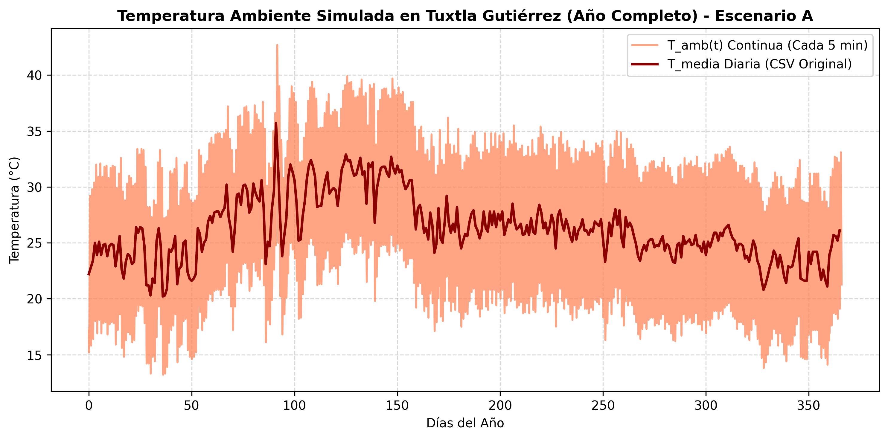{#fig-clima-anual}

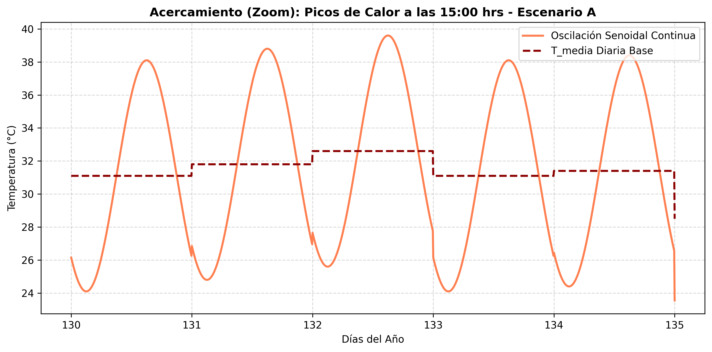{#fig-clima-zoom}

## Parametrización Física, Cinética y Estocástica {#sec-parametrizacion-fisica}

Una vez construido el entorno climático, inicializamos las constantes que controlan la termodinámica del equipo institucional Haier HBC-150 y las propiedades fisicoquímicas de las vacunas.

### Parámetros Termodinámicos y Biológicos {#sec-params-termo}

Asignamos los coeficientes térmicos estimados para la Ecuación Diferencial Estocástica (EDE) de Orstein Uhlenbeck. Alineados a las normativas vigentes, el termostato y la temperatura inicial del equipo se establecen en $\theta = 5.0^\circ\text{C}$ y $T_0 = 5.0^\circ\text{C}$. Cuando el equipo tiene suministro eléctrico, la tasa de abatimiento térmico es de $\kappa_{on} = 0.1154\,\text{hr}^{-1}$, con una volatilidad interna debido a los ventiladores de $\sigma_{on} = 0.4804$, calculados en la @sec-regimen-1. 

Ante una falla eléctrica, el compresor se apaga. El aislamiento de alta densidad del equipo frena la transferencia de calor exterior con una inercia pasiva de $\kappa_{off} = 0.00232\,\text{hr}^{-1}$ y un ruido por microfiltraciones de $\sigma_{off} = 0.048$, estimado en la @sec-regimen-2. 

Para modelar la degradación biológica, utilizamos la ecuación de Arrhenius (@eq-Arrhenius) calibrada para un biológico termosensible representativo. La energía de activación se fija en $E_a = 85,000\,\text{J/mol}$, la constante de los gases en $R = 8.314\,\text{J/(mol}\cdot\text{K)}$ y el factor preexponencial en $A = 1.2 \times 10^{13} \, \text{s}^{-1}$ (obtenidos en la @sec-Arrhenius). Adicionalmente, fundamentados en la termodinámica de fluidos, introducimos un **filtro de inercia térmica de 30 minutos**; es decir, asumimos que el biológico líquido dentro del frasco de vidrio tarda este periodo en igualar la temperatura interna del equipo, evitando contabilizar falsos daños por picos térmicos breves.

### Apertura de Puertas ($N_{puerta}(t)$) {#sec-aperturas-puerta}

La interacción humana se modela extrayendo vacunas únicamente durante las jornadas laborales (lunes a viernes). Para evaluar el impacto logístico, la simulación adapta estas perturbaciones dependiendo del contexto operativo (como se vio en la @sec-perturbaciones-discretas), los tres escenarios de prueba se definen de la siguiente manera:

* **Escenario A (Línea Base):** No existe interacción humana; la tasa de aperturas es estrictamente cero durante todo el año.
* **Escenario B (Apego Normativo):** Se programa una apertura determinista a las 8:00 AM para la extracción de dosis diarias. Posteriormente, se activa un proceso de Poisson con intensidad $\lambda_{tarde} = 0.5 \text{ eventos/hora}$$ en un horario vespertino de 2 horas (de 15:00 a 17:00 hrs) para las aperturas aleatorias vespertinas de resguardo.
* **Escenario C (Contingencia):** Además de la extracción matutina y vespertina del Escenario B, se usa otro proceso de Poisson de alta frecuencia ($\lambda_{resurtido} = 0.4 \text{ eventos/hora}$) en un horario matutino de 5 horas (de 09:00 a 14:00 hrs) para simular viajes masivos de abastecimiento debido a la saturación del inventario.

Como se analizó en la @sec-salto-termico, cada apertura inyecta aire caliente al interior del equipo. Este impacto se calcula mediante un salto térmico aleatorio $\gamma_i$, extraído de una distribución Normal truncada (@eq-salto-termico) para reflejar la variabilidad real en el tiempo que la puerta permanece abierta.

### Riesgo Eléctrico de la CFE {#sec-riesgo-cfe}

El riesgo del suministro eléctrico se parametriza utilizando el comportamiento histórico de la Comisión Federal de Electricidad (CFE). Retomando los cálculos de la @sec-ppnh, programamos la tasa de fallas diarias $\lambda_{cfe}(t)$ para el Proceso de Poisson No Homogéneo. Este modelo promedia un aproximado de 64 cortes anuales, combinando un riesgo base constante con dos campanas estacionales que simulan el sobrecalentamiento de transformadores en primavera y la temporada de tormentas en verano:

$$
\lambda_{cfe}(t) = 0.0667 + 0.2314 \cdot \exp\left(-\frac{(t - 152)^2}{4050}\right) + 0.2048 \cdot \exp\left(-\frac{(t - 244)^2}{1800}\right)
$$

Para la duración de estos cortes, utilizamos una distribución Log-Normal calibrada por el método de los momentos en la @sec-lognormal-duracion para las distintas épocas del año: 

* **Temporada Base:** $\mu = 0.6766, \ \sigma = 0.6202$ 
* **Temporada de Calor:** $\mu = 0.9627, \ \sigma = 0.5106$ 
* **Temporada de Lluvias:** $\mu = 0.4668, \ \sigma = 0.3372$ 

## Precalibración Vectorizada de Eventos Externos

Antes de resolver numéricamente la Ecuación Diferencial Estocástica para la temperatura, el algoritmo ejecuta un módulo de precalculo vectorizado para optimizar los tiempos de ejecución. En esta fase, el programa simula de manera independiente las variables externas que afectarán al equipo institucional a lo largo del año.

Para el suministro eléctrico, el algoritmo recorre secuencialmente los 366 días del año. En cada jornada, consulta la intensidad estacional de la CFE y realiza un muestreo aleatorio de Poisson para determinar cuántas fallas eléctricas ocurrirán. Si el resultado es mayor a cero, selecciona una hora de inicio distribuida de manera uniforme entre las 0 y las 24 horas del día, y realiza un muestreo Log-Normal condicionado a la época del año para determinar la duración del corte. Con estos datos, el algoritmo modifica el vector de estado eléctrico $S(t)$, cambiando su valor de 1 (con energía) a 0 (falla eléctrica) durante el intervalo afectado.

Por otro lado, para modelar las aperturas de la puerta del equipo, se genera un vector binario de eventos evaluado en el dominio de tiempo discreto $t \in \{0, \Delta t, 2\Delta t, \dots, 8784\}$ horas. Dado que el paso de integración se fijó en $\Delta t = 5/60$ horas (5 minutos), este conjunto se particiona exactamente en 105,408 iteraciones para cubrir la totalidad del año. Este vector se construye de manera dinámica dependiendo del modelo evaluado: se mantiene nulo para el Escenario A, combina las aperturas matutinas fijas con la probabilidad vespertina ($\lambda_{tarde} \cdot \Delta t$) para el Escenario B, y adiciona la perturbación logística de resurtidos ($\lambda_{resurtido} \cdot \Delta t$) para el Escenario C.

Posteriormente, el algoritmo aplica una regla estricta de control operativo: multiplica el vector de aperturas por la función de estado eléctrico $S(t)$, evaluada en el mismo dominio de $[0, 8784]$ horas. Esto garantiza que si el centro de almacenamiento de vacunas se encuentra bajo un apagón en un instante específico ($S(t)=0$), la probabilidad de apertura en ese mismo instante de tiempo $t$ se reduce a cero de forma absoluta. Esto refleja el protocolo normativo real que prohíbe abrir el equipo sin energía eléctrica para evitar la pérdida acelerada de frío.

Finalmente, los eventos validos de apertura de la puerta del equipo se sustituyen por su respectiva magnitud de impacto térmico ($\gamma_i$), el cual es extraído de una distribución Normal truncada (@eq-salto-termico), finalizando así el vector discreto de saltos térmicos ($Saltos\_Termicos(t)$).

Para validar la correcta precalibración del entorno, ejecutamos una trayectoria anual de prueba fijando una semilla de control (`np.random.seed(42)`). La simulación generó una trayectoria eléctrica idéntica para los tres casos con un total de **68 apagones** en el año, en dónde hubo una notoria diferencia fue en el vector de saltos térmicos: el personal registró **0 aperturas** para el Escenario A (Línea Base), **493 aperturas** para el Escenario B (Apego Normativo), y **995 aperturas** debido a la saturación logística en el Escenario C (Contingencia).

## Resolución Numérica de la Ecuación Diferencial Estocástica (EDE)

Con los vectores de perturbaciones externas precalculados, el algoritmo ejecuta la resolución de la evolución de la temperatura interna del equipo y extrae las métricas de seguridad termodinámica para el equipo institucional.

### Integración Numérica por Cambios de Régimen

Para avanzar en el tiempo, el algoritmo recorre cada iteración $i \in [1, 105407]$. El índice arranca en 1 porque el primer valor corresponde a la condición inicial térmica del equipo ($T_0 = 5.0^\circ\text{C}$). En cada paso, se evalúa el estado del suministro eléctrico previo ($S_{t}[i-1]$), activando un cambio de régimen dinámico (*regime-switching*):

* Si el suministro está activo ($S=1$), se aplican los parámetros de convección forzada ($\kappa_{on}, \sigma_{on}$), llevando la temperatura hacia el objetivo del termostato ($\theta = 5.0^\circ\text{C}$) y sumando el salto térmico $\gamma_i$ si la puerta fue manipulada.
* Si el suministro presenta una falla ($S=0$), se aplican los parámetros de inercia térmica pasiva ($\kappa_{off}, \sigma_{off}$), provocando que la temperatura interna sea atraída lentamente hacia la temperatura ambiente exterior de Tuxtla Gutiérrez ($T_{amb}[i-1]$).

La solución numérica se ejecuta mediante el esquema de Euler-Maruyama desarrollado en la @sec-euler-maruyama. Es importante destacar que, dado que las volatilidades térmicas ($\sigma_{on}$ y $\sigma_{off}$) actúan como ruidos aditivos constantes (independientes del estado de la temperatura $T(t)$), sus derivadas parciales respecto al estado son nulas ($\frac{\partial \sigma}{\partial x} = 0$), con lo cual por propiedades del cálculo estocástico, el término de corrección de segundo orden del método de Milstein se multiplica por cero y desaparece, reduciéndose de forma exacta al esquema de Euler-Maruyama empleado en esta simulación.

### Resultados de Seguridad Termodinámica {#sec-resultados-seguridad}

El algoritmo registra cada evento en el que la temperatura interna del equipo cruza los límites normativos de seguridad (por encima de los $8^\circ\text{C}$ o por debajo de los $2^\circ\text{C}$). Es importante destacar que en esta trayectoria de prueba, la temperatura de la simulación nunca descendió por debajo del punto de congelación crítico ($0^\circ\text{C}$) en ninguno de los tres escenarios. El cálculo exacto del riesgo para la trayectoria de control inicial (semilla 13) arrojó los siguientes resultados para cada escenario operativo:

**Escenario A (Línea Base):**

* **$T(t)>8^\circ\text{C}$:** Se tuvo un total de 40 eventos, sumando un tiempo acumulado de 22.25 horas que representa el 0.25% del año; el primer registro ocurrió en el Día 60.99.
* **$T(t)<2^\circ\text{C}$:** Se tuvo un total de 13 eventos, sumando un tiempo acumulado de 3.58 horas que representa el 0.04% del año, registrando la primera caída térmica fuera de la norma en el Día 110.25.
* **Tiempo Total Fuera de Rango:** La suma de las excursiones térmicas resultó en un total de 25.83 horas que representa el 0.29% del año operando fuera del rango normativo.

**Escenario B (Apego Normativo):**

* **$T(t)>8^\circ\text{C}$:** Se observó un incremento notable con un total de 177 eventos, acumulando un total de 121.83 horas que representa el 1.39% del año; debido a la interacción humana, la primera falla crítica se adelantó drásticamente hasta el Día 4.65.
* **$T(t)<2^\circ\text{C}$:** Ocurrieron únicamente 3 eventos con un tiempo acumulado de 0.83 horas que representa el 0.01% del año, manteniendo su primer registro en el Día 110.25.
* **Tiempo Total Fuera de Rango:** El equipo operó en condiciones de riesgo durante un total de 122.67 horas que representa el 1.40% del año simulado.

**Escenario C (Contingencia):**

* **$T(t)>8^\circ\text{C}$:** El estrés logístico provocó un total de 435 eventos, alcanzando un tiempo acumulado severo de 475 horas que representa el 5.41% del año; al igual que en el escenario anterior, el primer registro de falla ocurrió rápidamente en el Día 4.65.
* **$T(t)<2^\circ\text{C}$:** Debido a la saturación de calor por aperturas constantes, no se registró ningún evento de enfriamiento excesivo, manteniéndose un acumulado de 0.00 horas.
* **Tiempo Total Fuera de Rango:** En este contexto, el equipo sumó un total de 475 horas operando fuera de rango, lo que representa el 5.41% del año.

### Análisis Comparativo de Trayectorias: Visión Macro (Anual)

A continuación, se presentan las soluciones numéricas completas para un año de simulación bajo los tres escenarios. 

{#fig-anual-a}

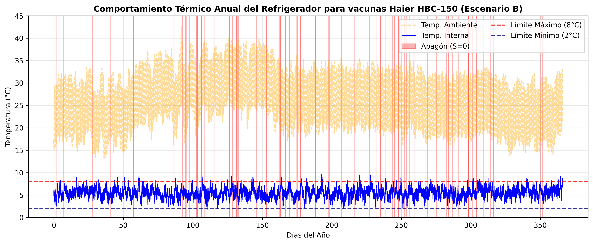{#fig-anual-b}

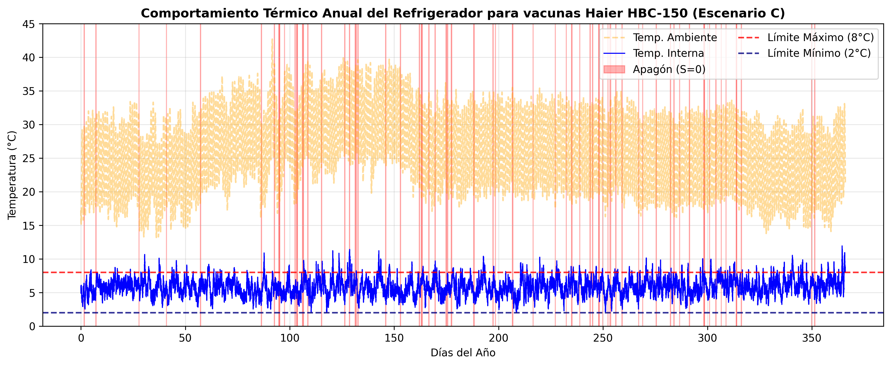{#fig-anual-c}

**Interpretación Anual:**
La visualización anual demuestra de forma contundente la sensibilidad del sistema a la interacción humana. En el Escenario A, el aislamiento térmico del equipo y el clima de la región son suficientes para mantener la temperatura segura durante los primeros dos meses (enero y febrero), presentando fallas a partir de la época de calor extremo. Conforme avanzamos al Escenario B y C, el volumen de excursiones superiores a $8^\circ\text{C}$ crece agresivamente (pasando de 40 a 435 eventos). Esto prueba que el suministro eléctrico de la CFE, aunque deficiente, no es el destructor principal de la cadena de frío, sino el estrés logístico de las aperturas continuas.

### Análisis Comparativo de Trayectorias: Visión Micro (Acercamiento Mensual)

Para aislar el comportamiento de la Ecuación Diferencial Estocástica y los impactos térmicos instantáneos ($\gamma_i$), se realizó un acercamiento al primer mes de la simulación.

{#fig-zoom-a}

{#fig-zoom-b}

{#fig-zoom-c}

**Interpretación Mensual:**
A nivel mensual, se observa cómo el esquema de Euler-Maruyama resuelve la dinámica de reversión a la media (atracción hacia el termostato de $5^\circ\text{C}$). Un hallazgo estadístico notable es la coincidencia exacta del primer evento de excursión crítica en los escenarios B y C (ocurrido en el Día 4.65). Esto no es un error numérico, sino la consecuencia directa del modelo acoplado: en el Día 4.65 en el Escenario B y C ocurrió una apertura vespertina con un alto impacto térmico ($\gamma_i$) que provocó que la temperatura del equipo superara el umbral de los $8^\circ\text{C}$.

## Integración de la Dinámica Logística y Mermas

Para pasar de una pérdida de viabilidad teórica a la pérdida de vacunas, acomodamos la simulación a un modelo de inventario dinámico ($I(t)$), donde $t$ representa el tiempo cada 5 minutos. El algoritmo avanza en el tiempo y evalúa tres reglas operativas clave para la logística:

1. **Consumo Logístico:** Dependiendo del escenario como se vio en la @sec-dinamica-inventario, el volumen de vacunas se descuenta del inventario. Para el Escenario A (Línea Base), el consumo es cero. Para el Escenario B (Apego Normativo), se extrae una cantidad diaria fija a las 8:00 AM que varía según el mes (ej. mayor demanda en octubre por la campaña de Influenza). Para el Escenario C (Contingencia), el consumo acelera y se acopla de manera dinámica a los eventos de resurtido a lo largo de la jornada.
2. **Inercia Térmica y Daño Farmacológico:** La temperatura $T(t)$ calculada por la EDE corresponde al aire interno del equipo. Sin embargo, el biológico líquido dentro de los frascos de vidrio posee inercia térmica. Para modelar este retardo físico, el algoritmo aplica un filtro de tolerancia de 30 minutos: la ecuación de Arrhenius solo entra en vigor si el aire permanece por encima de los 8°C de manera ininterrumpida durante 6 iteraciones continuas. Cumplida esta condición, se extrae la fracción de pérdida y se multiplica por el inventario actual en ese instante de tiempo, sumando el resultado al vector de dosis destruidas.
3. **Reabastecimiento Automático:** Si el inventario cae por debajo del punto de reorden de 1000 dosis (el 20% de su capacidad máxima), se simula la llegada de la ruta jurisdiccional que llena el equipo hasta su capacidad máxima de 5000 dosis, registrando el ingreso en la sumatoria anual para calcular el porcentaje de pérdida final.

### Resultados del Impacto Logístico

Al finalizar el año de simulación para la trayectoria de control (semilla 13), la interacción entre la EDE, el filtro de inercia de 30 minutos y el modelo de inventario arrojó los siguientes resultados totales de pérdida física:

**Escenario A (Línea Base):**
Dado que no existe consumo operativo, el equipo operó de manera estática, registrando un ingreso total y único de 5000 dosis al inicio del año. De este volumen inmovilizado, los cortes eléctricos de la red externa lograron destruir un total de 108 dosis, lo que representa un porcentaje de pérdida anual del 2.16%.

**Escenario B (Apego Normativo):**
La dinámica de vacunación diaria generó una sana rotación del inventario, registrando un ingreso total de 25373 dosis a lo largo del año. Gracias a que las aperturas de la puerta son moderadas, el control térmico se mantuvo estable y únicamente se destruyeron 414 dosis, logrando el porcentaje de pérdida anual más bajo de los tres escenarios con apenas un 1.63%.

**Escenario C (Contingencia):**
La contingencia obligó a realizar viajes masivos de reabastecimiento, elevando drásticamente el flujo anual a 77843 dosis. La coincidencia del alto volumen de vacunas almacenadas con el colapso térmico, provocado por la saturación de aperturas, provocó una destrucción severa de 2395 dosis, alcanzando el porcentaje de pérdida anual más alto con un 3.08%.

### Análisis Comparativo del Inventario y Riesgo Materializado

Para visualizar cómo interactúa el consumo operativo con los momentos exactos de falla termodinámica, se generaron gráficas de doble eje para los tres escenarios en estudio.

{#fig-logistica-a}

{#fig-logistica-b}

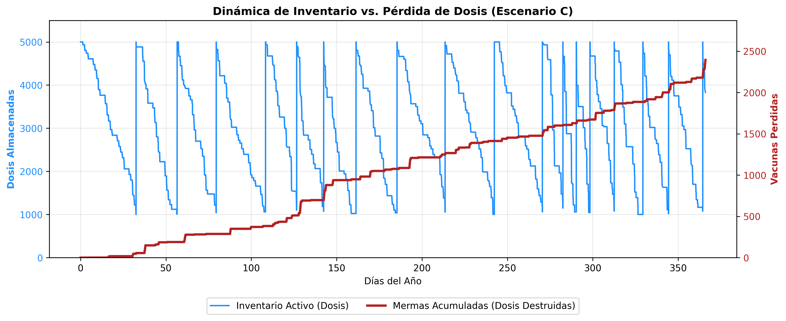{#fig-logistica-c}

**Interpretación de la Dinámica Logística:**

La visualización del inventario revela una aparente contradicción de riesgo. Como se vio anteriormente en la @sec-resultados-seguridad, el Escenario A tuvo menos excursiones térmicas que el Escenario B; sin embargo, su porcentaje de pérdida logística fue mayor (2.16% frente a 1.63%). Esto se debe al efecto protector de la rotación: en la Línea Base, las mismas 5000 dosis permanecen estancadas absorbiendo el impacto de cada corte eléctrico del año; en cambio, el Apego Normativo salva las dosis al aplicarlas en pacientes antes de que ocurran los apagones. 

No obstante, cuando el ritmo logístico sale de control (Escenario C), esta protección colapsa. El exceso de aperturas no solo rompe la cadena de frío, sino que al estar el equipo constantemente lleno, cada excursión térmica encuentra miles de vacunas vulnerables al mismo tiempo, multiplicando el daño absoluto a 2395 dosis, es decir, un 3.08% de pérdida anual.

## Estructura de la Simulación de Montecarlo

Con el fin de obtener validez científica y no depender del resultado de un solo escenario al azar, el algoritmo completo se incluyo dentro de una función para simular años completos de manera repetitiva. Para optimizar drásticamente la velocidad de ejecución y evitar el desbordamiento de la memoria RAM del sistema durante el análisis masivo, el programa se diseñó para extraer y almacenar únicamente métricas estadísticas clave en cada iteración, omitiendo la conservación de los arreglos gigantes de datos por cada año evaluado. 

Entre las métricas extraídas de esta función se incluyen:

* **Termodinámica:** Horas acumuladas y conteo de las rupturas de la cadena de frío ($T(t)>8^\circ\text{C}$ y $T(t)<2^\circ\text{C}$), así como la vigilancia del riesgo crítico de congelación ($T(t)<0^\circ\text{C}$).
* **Logística y Riesgo:** El día exacto en que ocurrió la primera falla crítica, el total de dosis perdidas, el porcentaje anual de pérdida y la merma por mes para evaluar la estacionalidad del riesgo.

Esta función se ejecuta dentro de un bucle de Montecarlo con **5,000 simulaciones independientes**, asignando en cada paso una semilla de aleatoriedad indexada para garantizar la reproducibilidad del experimento. Al correr los 5,000 años simulados, el algoritmo elimina las variaciones extremas de los casos individuales y permite que actúe la **Ley de los Grandes Números** [@ross2018first]. Esto provoca que las métricas de control se estabilicen firmemente, permitiendo extraer promedios poblacionales realistas sobre el comportamiento del equipo institucional bajo cada uno de los tres escenarios operativos evaluados.

## Resultados Estadísticos y Análisis de Riesgo

Una vez completadas las 5,000 simulaciones de Montecarlo, procedemos a extraer las métricas operativas y termodinámicas de todos los años simulados. La simulación masiva de trayectorias revela el verdadero comportamiento del sistema a largo plazo, eliminando las variaciones extremas de un solo año al azar. 

A continuación, se presenta la tabla comparativa con los promedios poblacionales empíricos, seguida del análisis descriptivo de dispersión e intervalos de confianza para cada escenario.

| Métrica (Promedio Anual) | Escenario A (Línea Base) | Escenario B (Apego Normativo) | Escenario C (Contingencia) |
| :--- | :---: | :---: | :---: |
| **Perturbaciones Externas** | | | |
| Apagones de la CFE | 64.3 | 64.3 | 64.3 |
| Aperturas de Puerta | 0 | 499 | 998 |
| **Riesgo Termodinámico** | | | |
| $T(t) > 8^\circ\text{C}$ | 26.4 eventos | 134.6 eventos | 419.7 eventos |
| $T(t) < 2^\circ\text{C}$ | 25.2 eventos | 12.5 eventos | 9.0 eventos |
| $T(t) < 0^\circ\text{C}$ | 0 eventos | 0 eventos | 0 eventos |
| Tiempo Fuera de Rango Normativo| 24.4 horas (0.28%) | 95.6 horas (1.09%) | 420.6 horas (4.79%) |
| **Impacto Logístico (Mermas)** | | | |
| Dosis Perdidas (Volumen) | 61 dosis | 343 dosis | 1,905 dosis |
| Pérdida Relativa (%) | 1.21% | 1.36% | 2.57% |

### Riesgo Operativo y Termodinámico Empírico

**Escenario A (Línea Base):**
La simulación de Montecarlo estabilizó el riesgo externo en un promedio de 64.3 apagones anuales. Al no existir interacción humana (cero aperturas), el riesgo recae puramente en la termodinámica pasiva del equipo. Se registró un promedio de 26.4 rupturas de la cadena de frío anuales por encima de los $8^\circ\text{C}$ (acumulando 12.6 horas) y 25.2 rupturas por debajo de los $2^\circ\text{C}$ (acumulando 11.8 horas). Es necesario destacar que la inercia térmica protegió al equipo de la congelación profunda, manteniendo el riesgo por debajo de los $0^\circ\text{C}$ estrictamente en cero. En el ámbito logístico, esta exposición pasiva provocó una destrucción promedio de 61 dosis (1.21% de pérdida anual). Sin embargo, el intervalo de confianza del 95% resulta muy amplio, oscilando entre apenas 2 y hasta 179 dosis destruidas al año, lo que sugiere una alta volatilidad ante apagones inusualmente largos.

**Escenario B (Apego Normativo):**
Al introducir la interacción humana con un promedio de 499 aperturas anuales, el riesgo termodinámico aumentó significativamente. Los eventos donde $T(t) > 8^\circ\text{C}$ aumentaron a un promedio de 134.6, acumulando 90 horas de riesgo térmico (1.02% del año), en cambio, los eventos por debajo de los $2^\circ\text{C}$ disminuyeron a un promedio de 12.5, acumulando 5.6 horas (0.06% del año). Adicionalmente, el primer registro de falla crítica se adelantó drásticamente: de promediar en el Día 38 (Escenario A) a ocurrir en el Día 8. Este nivel de estrés aumentó las pérdidas a un promedio de 343 dosis anuales (1.36% de pérdida anual), con un intervalo de confianza del 95% que advierte escenarios de riesgo donde un equipo normado puede perder entre 166 y hasta 573 dosis en un solo año.

**Escenario C (Contingencia):**
La saturación logística colapsa por completo la cadena de frío. Con casi 1,000 aperturas anuales (998), el equipo sufre 419.7 rupturas de la cadena de frío anuales por encima de los $8^\circ\text{C}$ en promedio (acumulando 416.5 horas) y 9 rupturas por debajo de los $2^\circ\text{C}$ (acumulando 4.1 horas), acumulando un valor crítico total de 420.6 horas (4.79% del año) operando fuera de rango. Bajo este escenario de estrés extremo, el primer cruce fuera de la norma ocurre en promedio apenas en el Día 3 de operación. El impacto en el inventario es devastador: se pierden en promedio 1,905 dosis por año (2.57% de pérdida anual), con un intervalo de confianza del 95% que va de 1348 hasta las 2,521 dosis destruidas.

**Interpretación Comparativa del Modelo:**

Aplicando la **Ley de los Grandes Números**, a través de las 5,000 simulaciones se resolvió la contradicción de riesgo observada en la trayectoria de prueba inicial. Aunque en años individuales aislados la inmovilidad del inventario (Escenario A) puede resultar en una mayor pérdida relativa frente al consumo normativo (Escenario B) debido al efecto protector de la rotación de vacunas, el promedio poblacional a largo plazo demuestra lo contrario. A la larga, el volumen masivo de rupturas de la cadena de frío provocadas por las 499 aperturas del Escenario B sobrepasa cualquier beneficio de rotación, situando su pérdida promedio (1.36%) por encima del aislamiento absoluto (1.21%). Además, se confirma que el colapso operativo (Escenario C) no es un riesgo lineal, sino exponencial: duplicar las aperturas de puerta no duplicó las pérdidas, sino que las multiplicó por más de cinco veces (de 343 a 1,905 dosis), evidenciando la fragilidad termodinámica de los equipos frente a la saturación clínica.

### Análisis de Trayectorias

La tabla anterior revela que los intervalos de confianza del 95% para la pérdida de biológicos son muy amplios en todos los escenarios operativos. Para comprender visualmente la causa de esta dispersión, se extrajo una submuestra aleatoria de 30 trayectorias (30 años simulados distintos) para cada escenario. 

El comportamiento de los daños acumulados demuestra que el riesgo no es lineal. La tendencia de las dosis perdidas a lo largo de los 366 días depende estrictamente de la coincidencia temporal exacta entre la ocurrencia de un apagón prolongado de la CFE y el nivel de saturación de vacunas almacenadas en ese día específico.

{#fig-abanico-a}

{#fig-abanico-b}

{#fig-abanico-c}

**Interpretación Comparativa de las Trayectorias:**

Al observar el comportamiento de las 30 trayectorias conjuntas, se comprueba la hipótesis de fragilidad de la red de frío. En el Escenario A, el aislamiento absoluto permite que existan "años afortunados" donde el equipo apenas pierde unas cuantas dosis, pero basta un solo año con un apagón crítico prolongado para que la pérdida escale drásticamente (como se observa en la línea superior en la @fig-abanico-a que cruza las 200 dosis). 

Por el contrario, el Escenario C demuestra que la contingencia operativa elimina el factor "suerte". La densidad y homogeneidad de las trayectorias confirman que, bajo estrés logístico masivo, el colapso del biológico está garantizado independientemente de si el clima de ese año fue favorable o si hubo menos apagones. La saturación de aperturas domina por completo al sistema, provocando una destrucción acelerada, continua e inevitable.

### Estacionalidad del Riesgo Operativo

Al desglosar las pérdidas de dosis de forma mensual, los datos revelan el verdadero comportamiento del riesgo termodinámico a lo largo del año. Para evaluar esta métrica de forma rigurosa, se analizaron dos estimadores de centralidad: el promedio mensual (que es sensible a los años con apagones catastróficos) y la mediana mensual (estadísticamente más robusta porque representa el escenario más probable, aislando las fluctuaciones extremas).

Inicialmente, desde un punto de vista puramente climático, se podría suponer que los meses de calor extremo en Tuxtla Gutiérrez (abril y mayo) presentarían la mayor cantidad de vacunas perdidas debido al estrés térmico ambiental sobre el equipo. No obstante, las 5,000 simulaciones de Montecarlo demuestran que la interacción humana modifica por completo este patrón natural.

**Escenario A (Línea Base):**

::: {#layout-barras-a layout-ncol=2}
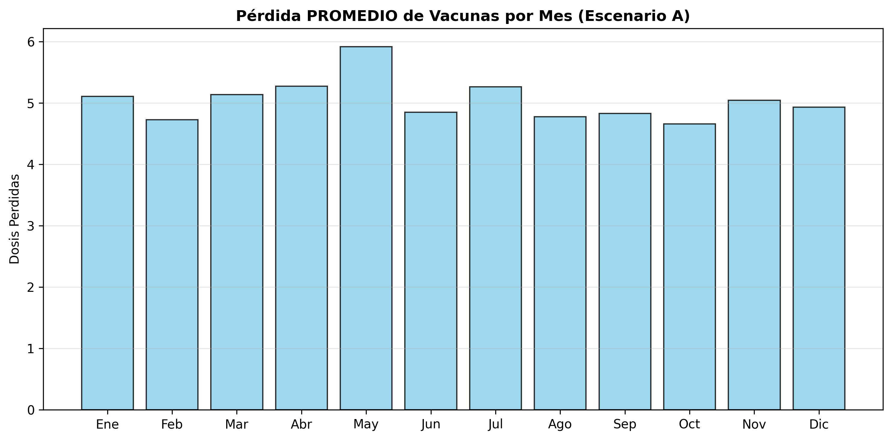{#fig-promedio-a}

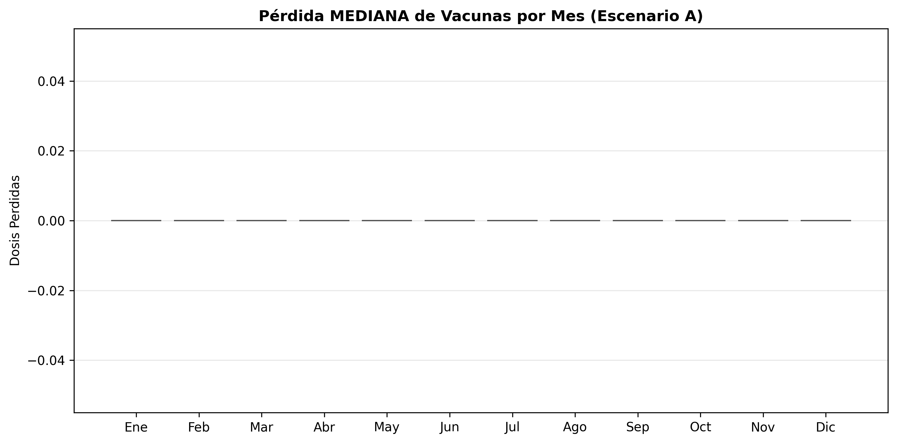{#fig-mediana-a}
:::

**Escenario B (Apego Normativo):**

::: {#layout-barras-b layout-ncol=2}
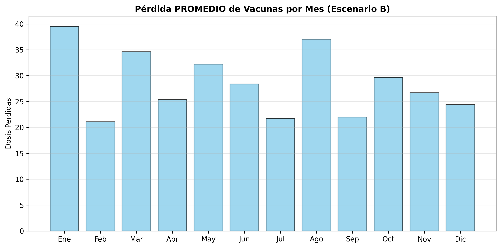{#fig-promedio-b}

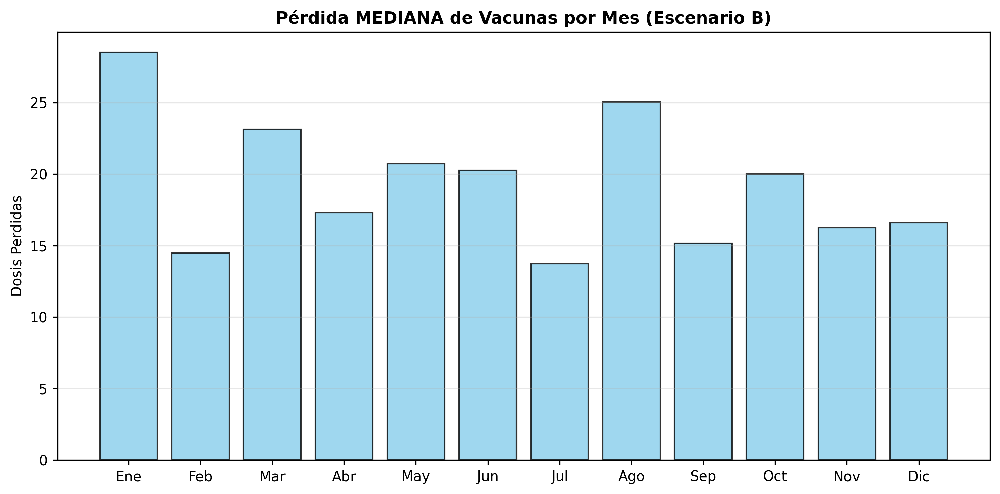{#fig-mediana-b}
:::

**Escenario C (Contingencia):**

::: {#layout-barras-c layout-ncol=2}
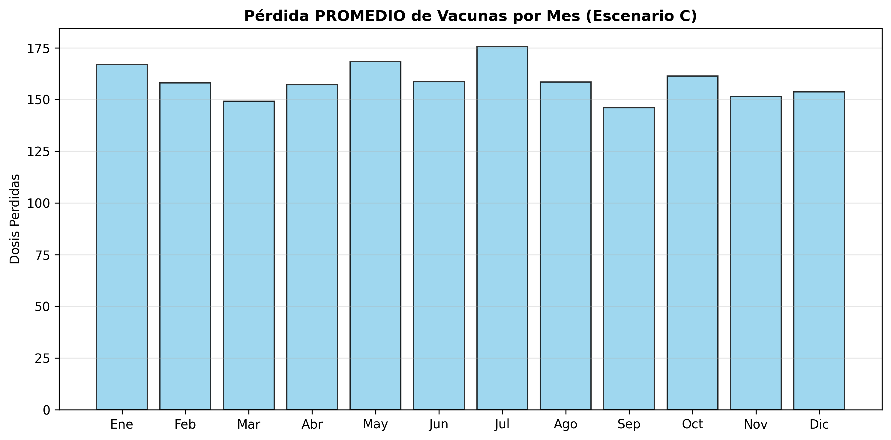{#fig-promedio-c}

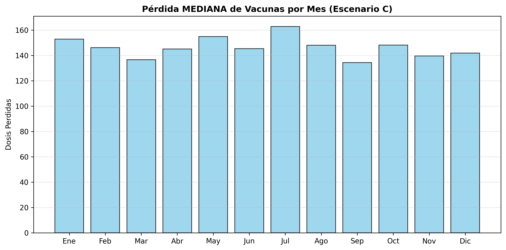{#fig-mediana-c}
:::

**Interpretación de la Estacionalidad:**

El análisis estacional confirma que **el estrés operativo domina por completo al factor climático.** En el Escenario A, la @fig-mediana-a demuestra que la infraestructura termoaislante del equipo Haier HBC-150 es lo suficientemente robusta para sobrevivir a la intemperie chiapaneca sin sufrir daños (mediana igual a cero en todos los meses). Las pérdidas residuales observadas en el promedio del Escenario A son producto exclusivo de la cola de la distribución (años atípicamente catastróficos).

Sin embargo, al introducir la interacción humana, el patrón climático desaparece. En el Escenario B, la vulnerabilidad ya no recae en la primavera, sino que se desplaza hacia enero y agosto, coincidiendo con las épocas donde el volumen del inventario interactúa de manera letal con las perturbaciones eléctricas. Finalmente, en el Escenario C, la contingencia operativa nivela el riesgo: el equipo pierde su capacidad de recuperación térmica provocando que todos los meses del año (sin importar si es invierno o verano) resulten devastadores para la viabilidad de las vacunas, consolidando la destrucción sistemática del inventario activo.

# DE AQUI

### Distribución del Riesgo Operativo

Para estandarizar el nivel de riesgo sin importar la escala de la unidad médica, las dosis destruidas se transformaron en porcentajes de pérdida relativa respecto al volumen total de vacunas manejadas por el equipo en cada año simulado. La visualización de la frecuencia de estas pérdidas a lo largo de las 5,000 iteraciones de Montecarlo nos permite analizar la forma de la distribución del riesgo para cada escenario operativo.

![Histograma del porcentaje de vacunas perdidas anualmente (Escenario A)[cite: 13]. La distribución presenta una fuerte asimetría positiva (una cola larga estirada hacia la derecha). Esto indica que, aunque la concentración principal de los datos sugiere pérdidas bajas (mediana del 1.01%), existen años atípicamente catastróficos que arrastran el promedio general hacia arriba (1.21%). Las líneas rojas punteadas delimitan el intervalo empírico del 95%, mostrando la alta dispersión hacia escenarios extremos.](histograma_porcentajes_escenario_A.png){#fig-hist-a}

![Histograma del porcentaje de vacunas perdidas anualmente (Escenario B)[cite: 14]. Al introducir el estrés logístico normativo, la distribución completa se desplaza hacia la derecha, incrementando tanto la mediana (1.32%) como la media (1.36%). Aunque la asimetría disminuye ligeramente en comparación con la Línea Base, la cola derecha sigue advirtiendo de escenarios de riesgo donde la pérdida relativa supera el 2.20%.](histograma_porcentajes_escenario_B.png){#fig-hist-b}

![Histograma del porcentaje de vacunas perdidas anualmente (Escenario C)[cite: 15]. La contingencia extrema transforma drásticamente la forma de la distribución, volviéndola visualmente simétrica (similar a una campana de Gauss). La media (2.57%) y la mediana (2.56%) prácticamente se igualan, consolidando un nivel de destrucción base sumamente alto y un intervalo de confianza del 95% altamente concentrado.](histograma_porcentajes_escenario_C.png){#fig-hist-c}

**Interpretación de las Distribuciones:**

La visualización de los histogramas demuestra que la dinámica del riesgo evoluciona conforme aumenta la interacción humana. En el Escenario A y B, la clara separación entre la media (línea azul) y la mediana (línea verde) evidencia que los datos están sesgados; este comportamiento asimétrico es típico de los sistemas de riesgo operativo pasivos, donde los daños dependen de fallas externas intermitentes y severas (como los apagones prolongados de la CFE). 

Sin embargo, en el Escenario C, la distribución adopta una forma simétrica. Esto ocurre gracias al Teorema del Límite Central: la altísima frecuencia de aperturas de puerta (casi 1,000 al año) se convierte en el factor dominante del sistema, "suavizando" el impacto de los apagones aislados y garantizando una tasa de pérdida constante y predeciblemente alta. La asimetría visual observada en los primeros dos escenarios sugiere fuertemente que las distribuciones no siguen un comportamiento normal, lo cual requiere una comprobación matemática estricta antes de realizar inferencias poblacionales definitivas.

# HASTA AQUI

#imagenes finales sin interpretacion momentanea

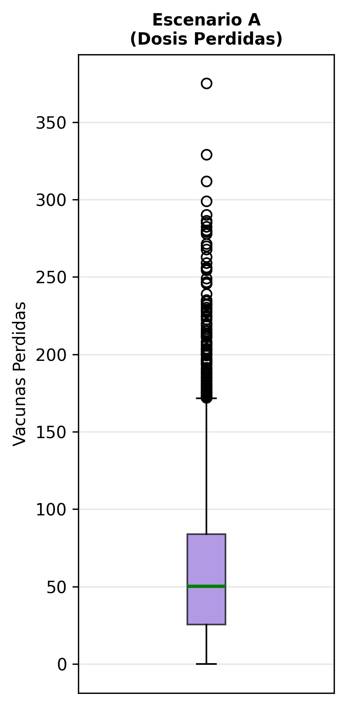{#fig-boxplot-final-escenario-A}

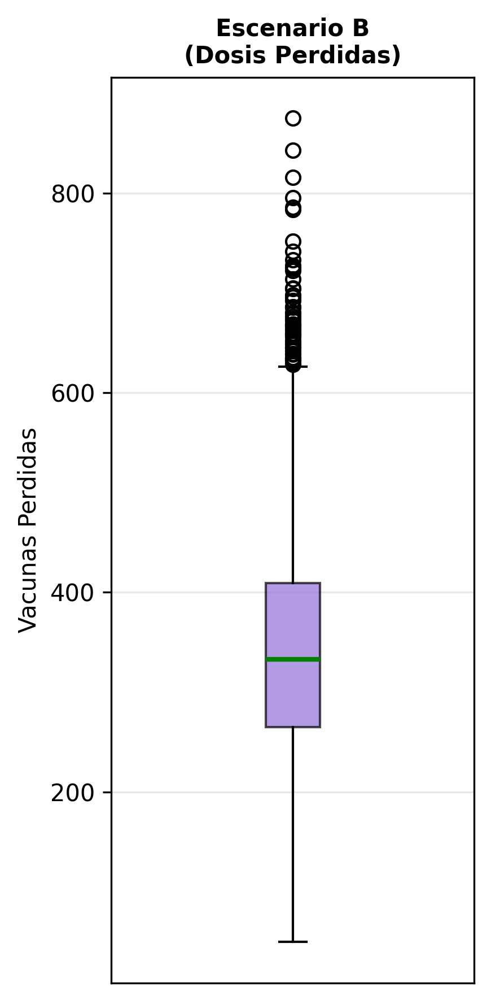{#fig-boxplot-final-escenario-B}

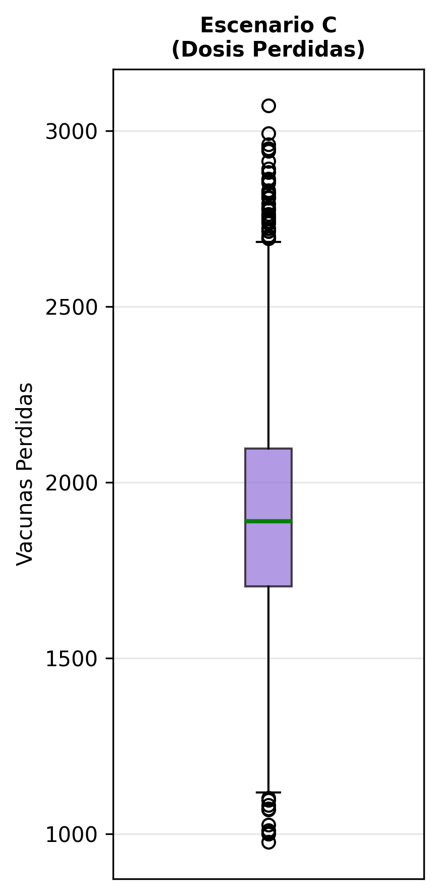{#fig-boxplot-final-escenario-C}

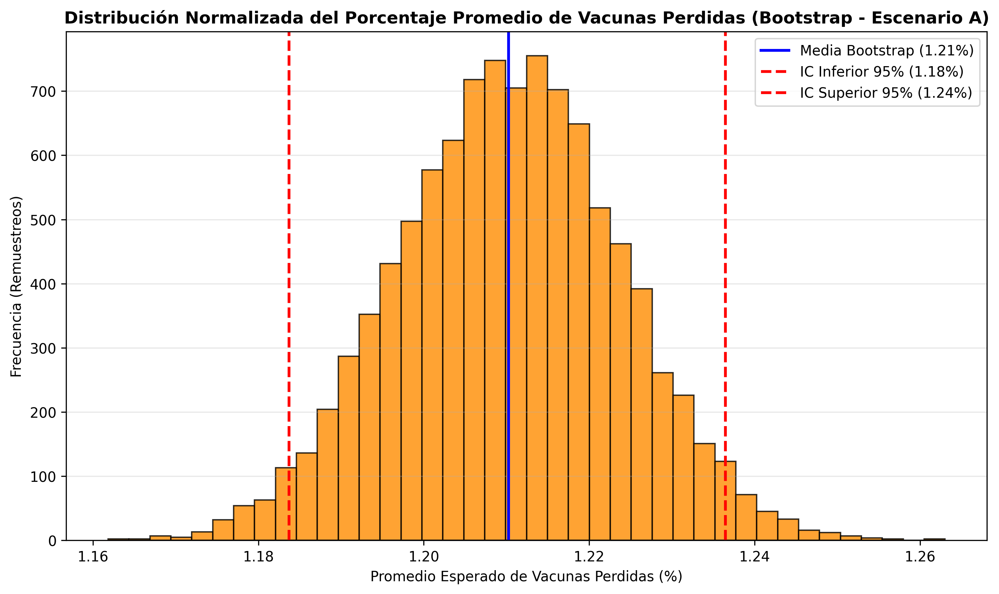{#fig-histograma-bootstrap-escenario-A} 

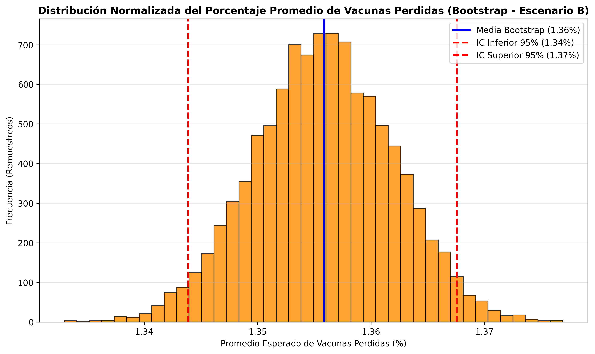{#fig-histograma-bootstrap-escenario-B}

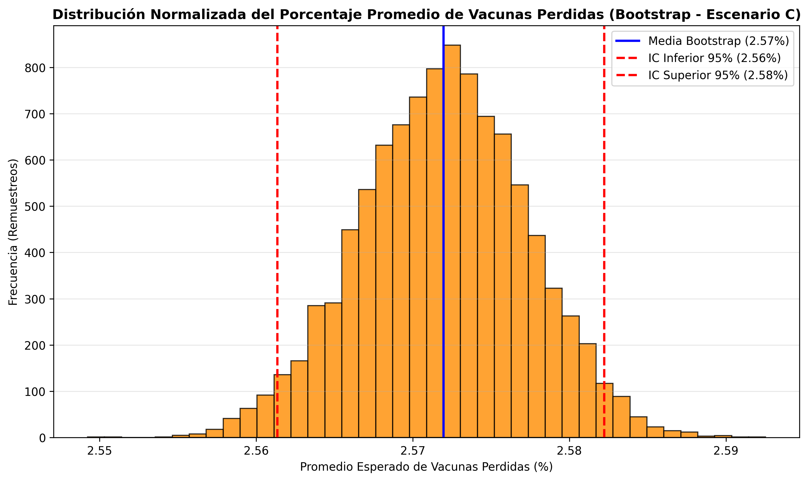{#fig-histograma-bootstrap-escenario-C}

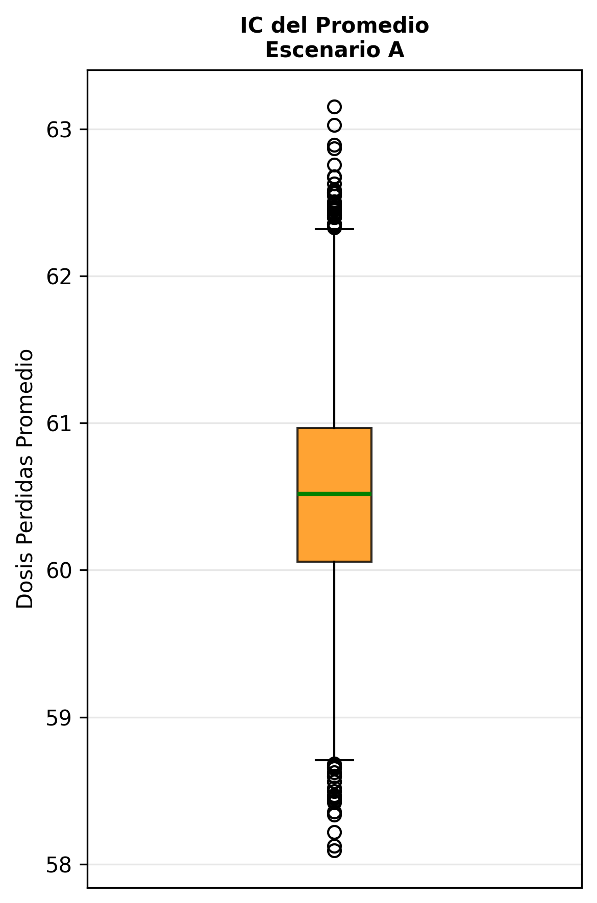{#fig-boxplot-bootstrap-escenario-A}

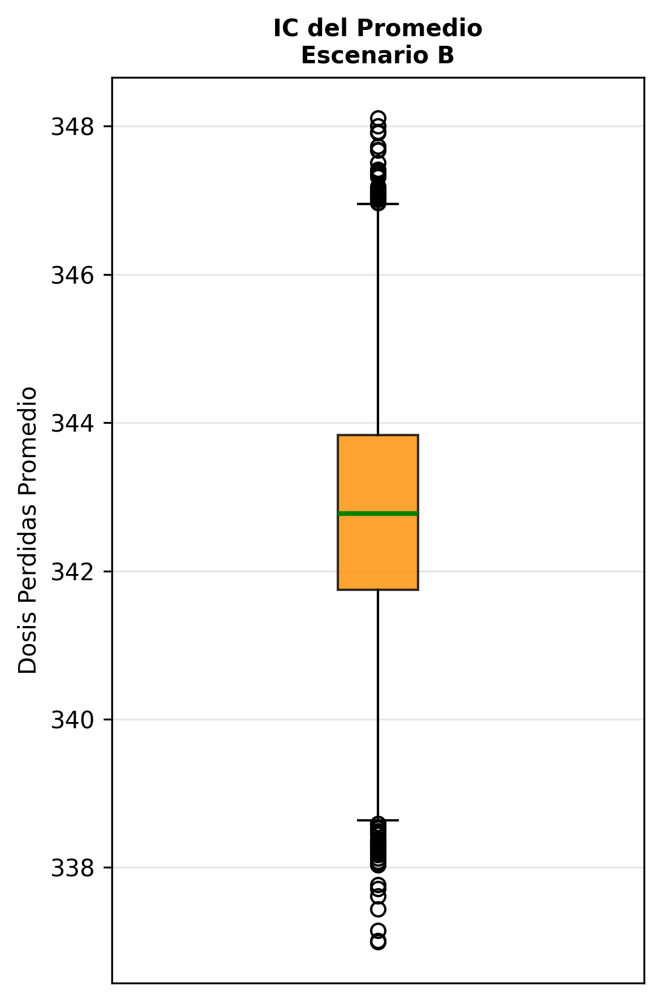{#fig-boxplot-bootstrap-escenario-B}

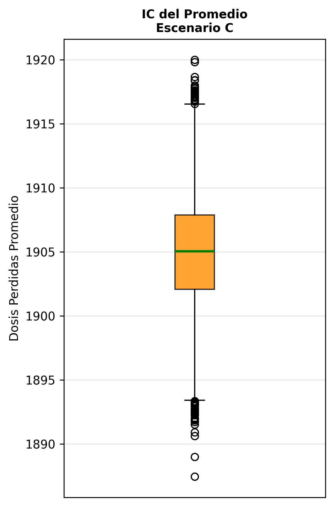{#fig-boxplot-bootstrap-escenario-C}